---
# Page settings
layout: default
keywords:
comments: false

# Hero section
title: Sketch Cloud
description: Learn how to work with Sketch Cloud from Lunacy
icon: 'upload-2'

# Micro navigation
micro_nav: false

# Page navigation
page_nav:
    next:
        content: Shortcuts
        url: '/shortcuts'
    prev:
        content: Export
        url: '/export'
---

## Overview

Lunacy provides full support of Sketch Cloud. This enables you to upload your documents to Sketch Cloud and:

* Store your documents privately on Cloud.
* Access your documents from any location or computer.
* Share your documents with other people and gather feedback.
* Review different versions of documents.
* Collaborate with your team in the team area.
* View prototypes in action.

Except for some operations (such as team creation and comments), the bulk of the Sketch Cloud functionality is accessible directly from Lunacy.

This article focuses on how to make use of Sketch Cloud features in Lunacy. For general information about Sketch Cloud, as well as for specifics and licensing details, refer to <a href="https://www.sketch.com/docs/sketch-cloud/" target="_blank">Sketch documentation</a>.

## Basic terms

Before we talk about how to work with Cloud files in Lunacy, let's review the basic terms that we will be using.

### Cloud panel

**Cloud panel** is where you will find your Cloud documents and perform almost all Cloud-related operations in Lunacy. To open the Cloud panel, click the Cloud icon on the top toolbar. Click the back arrow to return to the Inspector.

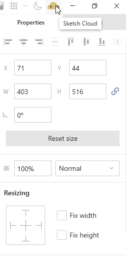

### Documents

**Documents** are .sketch files stored on Cloud. In Lunacy, your Cloud documents appear in the Cloud panel, under your Cloud username. The most recent documents come first. For your convenience, there is a filter that allows you to quickly switch between:

* Documents (documents without projects only)
* All documents (including documents from projects)
* Files shared with you
* Libraries

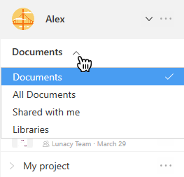

### Projects

**Projects** are a way to organize *documents* stored on Cloud. You can think of projects as of folders in Windows. Projects appear below the list of documents in the A-Z order. When you add a new project, it has the name *Project*. You can rename it to whatever you want. The demo below shows how to create and rename projects, as well as how to move documents to projects.

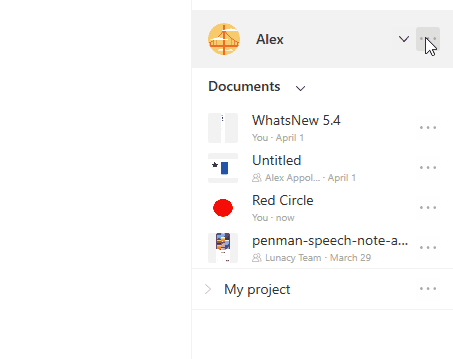

**Note:** If you delete a project, the documents from the project move to the common document list.

### Team documents

**Team documents** are documents stored in the team area. All team members can view team documents. Users with the contributor and admin roles can edit team documents. For details, click [here](#working-in-a-team-area).

### Shared documents

**Shared documents** are .sketch files that you share with other people or files that other people share with you. Depending on the [settings](#sharing-documents) defined by the file owner, users with access to shared files can:

* Open and view the file on Sketch Cloud or in Sketch/Lunacy.
* Leave their comments to the document in the Cloud.
* Download and work with the file locally on their computers.
* Use the file as a library.

You cannot edit Cloud versions of documents shared with you.

### Libraries

**Libraries** are *shared documents* that you can use similarly to what we in Lunacy call <a href="https://docs.icons8.com/libraries/#ui-kits" target="_blank">UI kits</a>. When the owner of the file updates it in the Cloud, the updates become available to everyone who has access to the file. For details, click [here](#working-with-libraries).

## Signing into Sketch Cloud

To sign into the Sketch Cloud from Lunacy, click the Cloud icon on the top toolbar and enter your Sketch Cloud credentials in the displayed form (see the figure below). You can also use this form to create a new Cloud account and even to reset you password.

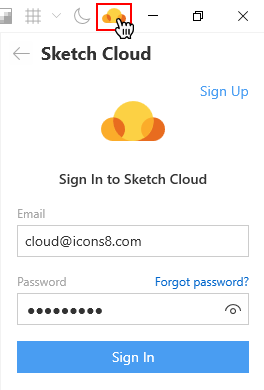

## User settings

After successful sign-in, you will see your Cloud username and avatar, as well as the list of your documents and projects if you've already had some in the Cloud.

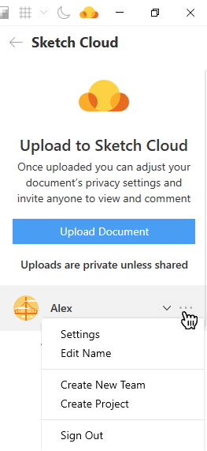

Almost all Cloud-related actions are performed through context menus invoked by a right-click or clicking the three dots button next to the respective UI element. The menu invoked from the user panel features the following options:

* **Settings**: Brings you to your Cloud settings page.
* **Edit name**: Allows you to change your username not leaving Lunacy.
* **Create New Team**: Brings you to the Cloud team creation page (see also [Team settings](#team-settings)).
* **Create Project**: Adds a new project to your list of documents and projects.
* **Sign out**: Signs you out of the Cloud.

You can also setup your avatar, if you don't have it yet. For this, just click the avatar automatically set by the Cloud and browse to the image file. To remove or update your image, right-click the avatar and select the respective command on the displayed menu, see the figure below.

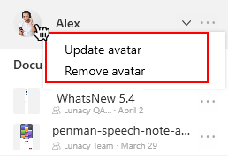

## [Team settings](#team-settings)

The list of team settings available to you in Lunacy depends on your access type and role within a team. As a team administrator, you will have access to the following:

* **Settings**: Opens the team settings dialog box, where you can:

  * Invite new members to the team.
  * Manage roles of existing team members.
  * Remove users from the team.

* **Edit name**: Allows you to rename the team.
* **Create project**: Creates a new project within this team area.

{:.is-big}
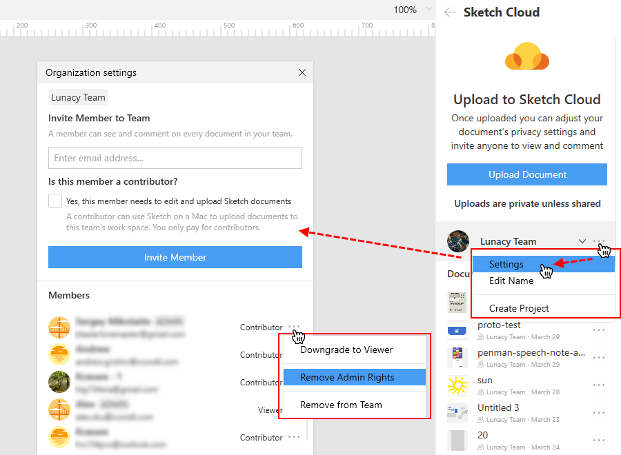

As a team administrator, you can also setup your team's avatar. For this, just click the avatar automatically set by the Cloud and browse to the image file. To remove or update your image, right-click the avatar and select the respective command on the displayed menu.

If you don't have administrative privileges, you can only view the list of team members (click **Settings** on the context menu) and create new projects.

## Saving a document to Sketch Cloud

To save a document to Sketch Cloud:

1. Click the Cloud button on the top toolbar. The Cloud panel appears on the right.
2. In the Cloud panel, click **Upload Document**.

If you've been working with a file that you already had on your computer, a new file tab with the Cloud document will appear once the uploading is complete. Cloud documents appear in the Lunacy interface with the Cloud icon in front of their names (see the demo below). Bear in mind that the local file and the Cloud file are two independent files. Changes to the local file will not affect the Cloud one and vice versa.

{:.is-big}
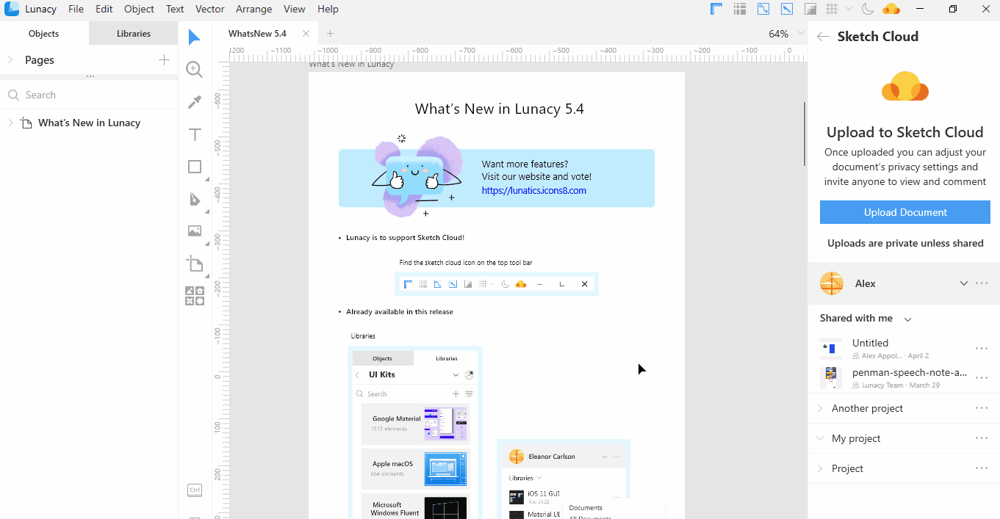

## Updating a document in the Cloud

If you make changes to a Cloud-based document, you can submit the changes or save them to a new Cloud document. For this, use the **Update Document** or the **New Upload** buttons in the Cloud panel.

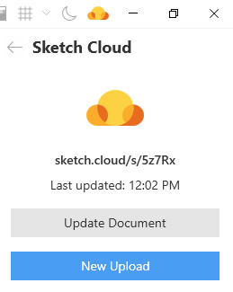

## Working with your own documents

As it was mentioned, almost all actions with Cloud-based documents are performed through context menus.

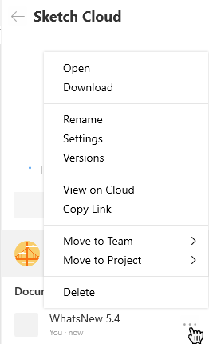

The commands available to the document owner include the following:

* **Open**: Opens the document as a Cloud document.
* **Download**: Downloads the document to your computer and opens its local copy.
* **Rename**: Allows you to rename the document.
* **Settings**: Opens a dialog box where you can configure the document sharing settings. For details, click [here](#sharing-documents).
* **Versions**: Opens a panel from which you can download the required version of the document (see the figure below).

{:.is-big}
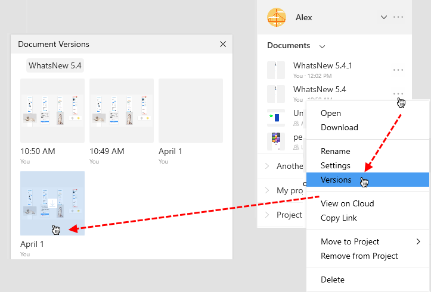

* **View on Cloud**: Opens the document's Sketch Cloud webpage.
* **Copy link**: Copies the link to the document to your clipboard. Before sending the link, make sure that the document has proper [sharing settings](#sharing-documents). The link to the document also appears at the top of the Cloud panel and you can copy it from there.

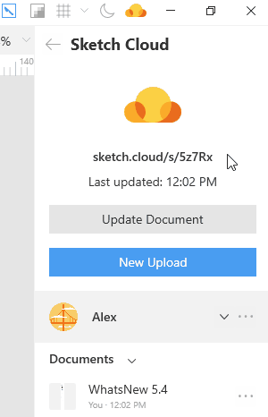

* **Move to Team**: Allows you to move personal documents to the team area.
* **Move to Project**: Allows you to organize your documents into projects.
* **Delete**: Deletes the document from the Cloud.

## [Sharing documents](#sharing-documents)

If you want to share a document, you should configure its sharing settings first. These settings are similar to those available to users on Sketch Cloud. The figure below shows the default settings.

{:.is-big}
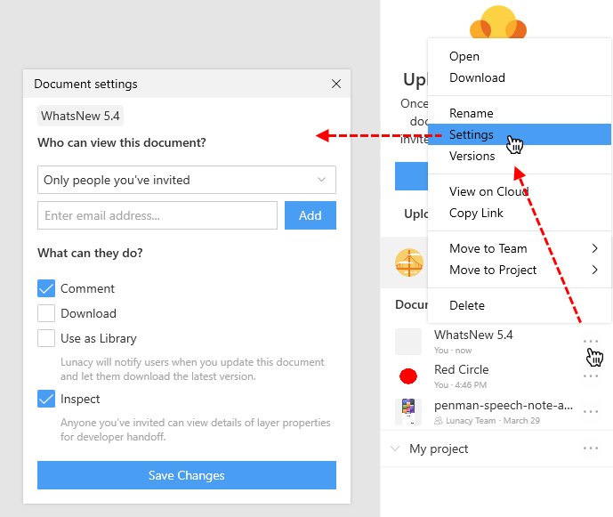

The settings are as follows:

* **Who can view this document?** You can select between two options:

  * *Only people you've invited* - to send an invite, you should enter the person's email address in the edit field below and click **Add**.
  * *Anyone with the link and the people you've invited* - don't forget to select this option if you decide to share the document by sending a link.

* **What can they do?** Select the required options:

  * *Comment* - commenting is available only through the document webpage. A user should open the link to the document in a browser.
  * *Download* - those who have access to the document will be able to save the document to their computer.
  * *Use as Library* - with this option selected, those who have access to the document will be able to use it as a library. For details, click [here](#working-with-libraries)
  * *Inspect* - with this options selected those who have access to the document will have access to the <a href="https://www.sketch.com/docs/sketch-cloud/#cloud-inspector-beta" target="_blank">Cloud Inspector</a>.

When you are done with configuring sharing settings, click **Save** at the bottom of the dialog box.

## [Working in a team area](#working-in-a-team-area)

To become a member of a team you should accept an invite to the team sent to you by email. Only after that you will get access to the team area. To switch between your personal and team areas, click the down arrowhead next to your username an select the required area.

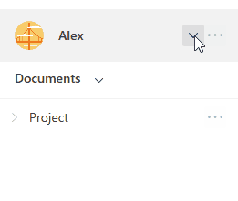

What you can do in the team area depends on your user role:

* **Viewers** can only view documents stored in the team area.
* **Contributors** can edit, delete and upload new documents to the team area. The procedure are the same as in the personal area.
* **Admins** have all the privileges of contributors, plus they can manage [team settings](#team-settings).

**Note:** Remember that Sketch Cloud does not support multi-user editing. For this reason, several team members should not work on the same document at the same time.

## Working with shared documents

There are two ways of sharing a document: by means of links and by means of invites.

If someone shared a document with you using a link, you will only be able to access the document through the browser.

If the document owner sends you and invite:

1. Open the email message with the invite.
2. Click the **Accept the invitation** in the body of the message. A Sketch Cloud page opens in your browser.
3. On the displayed page, accept the invitation once again. After that, the document will appear in the list of your cloud documents in Lunacy. Use the **Shared with me** filter to find it, if needed.

The screenshot below shows a view of the context menu of a shared document with maximum [privileges](#sharing-documents).

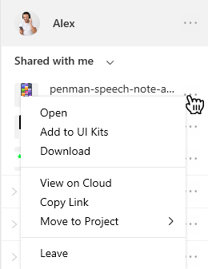

The available options include:

* **Open**: Opens the document in Lunacy (view only).
* **Add to UI Kits**:  Available for libraries only. Adds the library to the list of <a href="https://docs.icons8.com/libraries/#ui-kits" target="_blank">UI kits</a>. For details, click [here](#working-with-libraries).
* **Download**: Downloads the document to your computer.
* **View on Cloud**: Opens the document's Sketch Cloud webpage. There you can leave your comments to the document,
* **Copy link**: Copies the link to the document to your clipboard.
* **Move to Project**: Allows you to organize your documents into projects.
* **Leave**: Deletes the shared document from your document list.

## [Working with libraries](#working-with-libraries)

Libraries are shared documents that can be used as <a href="https://docs.icons8.com/libraries/#ui-kits" target="_blank">UI kits</a>. To provide for this, the owner of the document should enable the **Use as Library** option in the [document settings](#sharing-documents).

>**Note**: You should understand that to be able to use libraries according to their intent, library elements must be saved as <a href="https://docs.icons8.com/symbols/" target="_blank">symbols</a>.

Like other Cloud documents, libraries appear in the list of documents in the Cloud panel. You can quickly find them by applying the *Libraries* filter. To add a library to UI kits, click the respective command on the context menu.

Also, libraries available to you appear in the panel of UI kits (**Libraries** > **UI Kits** > **Import Cloud UI Kits**). Click the required library to add it to the list of UI kits.

{:.is-big}
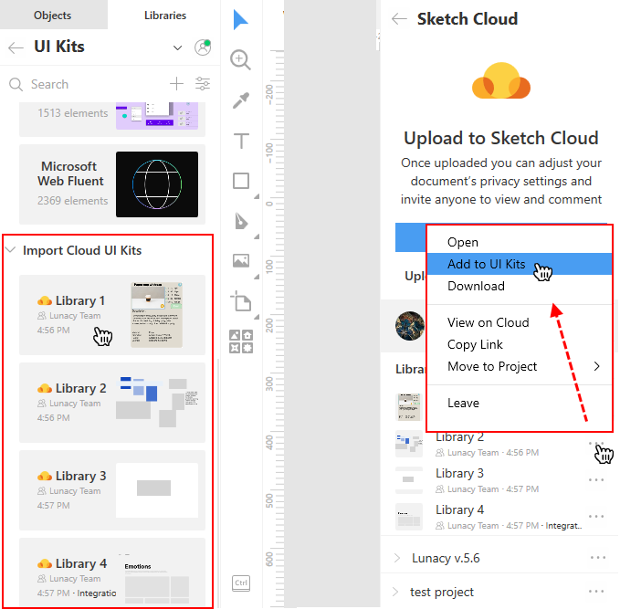

## Viewing prototypes in Cloud

If you are working on a prototype, you can view it in action on Sketch Cloud. For this:

1. Update the document in the Cloud to apply the latest changes.
2. Make sure that Cloud processing is complete.
3. Select an artboard from which you want to start preview. Note that the artboard should have a hotspot and a configured target.
4. Click the play button that will appear at the top bar.  

{:.is-big}
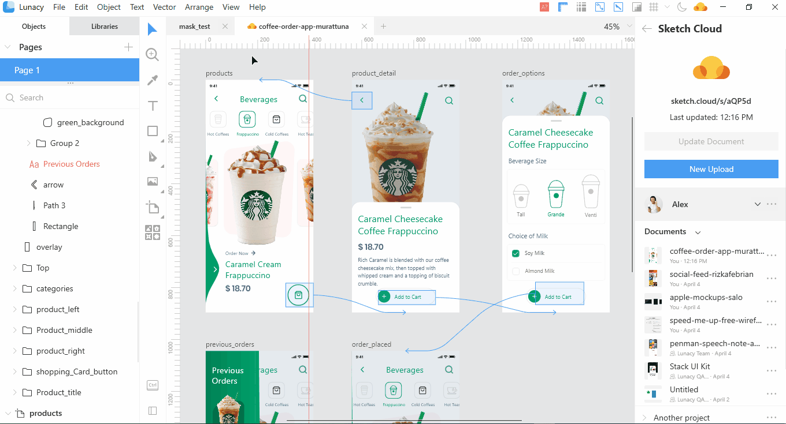

## Other Cloud-related controls

If you have a Cloud document open in Lunacy with no objects selected on the canvas, the **Cloud** section appears in the Inspector. It features the **Settings**, **Versions** and **Update Document** buttons. Similar options are available on the **File** menu (see the figure below).

{:.is-big}
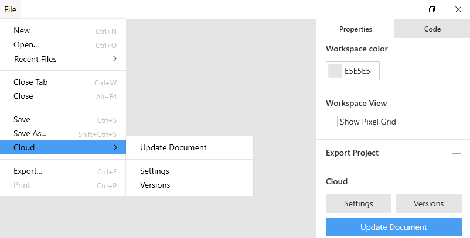
