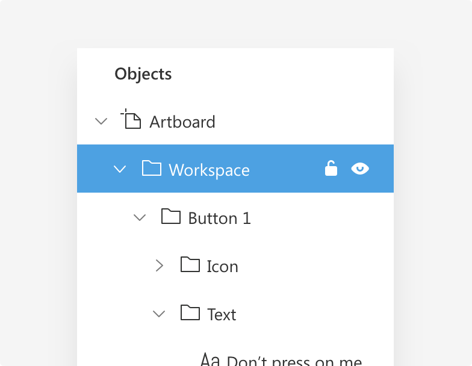
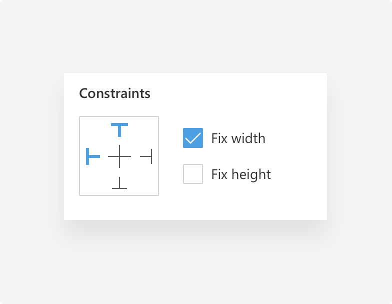
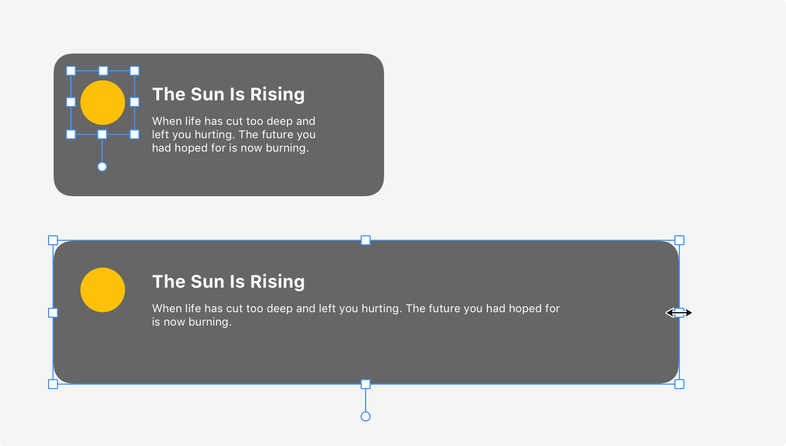
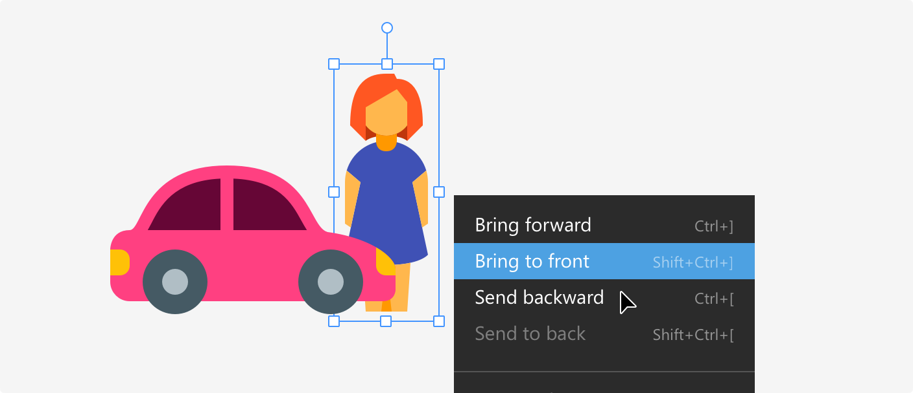
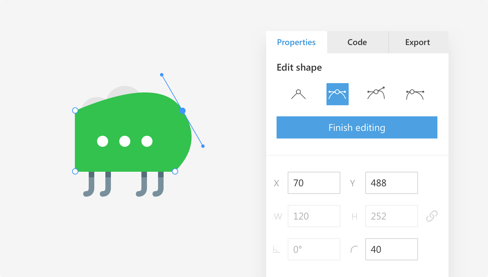

---
# Page settings
layout: default
keywords:
comments: false

# Hero section
title: Editing
description: Learn about tools that will help you create shapes you want
icon: 'pencil-tip'

# Micro navigation
micro_nav: false

# Page navigation
page_nav:
    next:
        content: Objects
        url: '/objects'
    prev:
        content: Interface
        url: '/interface'
---

## Selecting

Selecting objects in Lunacy is easy: You just click on an object in your canvas. Once the object is selected, you should see eight little handles along its outline; one in each corner and one in the center of each edge.

##### Sheep selected for breeding

Alternatively, you can use the Layer list to select an object. Clicking an object's name in the list selects it on the canvas.

You can select multiple objects by holding down the `Shift` key on the keyboard and clicking on other objects.

#### Selecting Group vs. Object

If you click on an object within a group, Lunacy selects the whole group. This is usually quite handy: You can easily move around whole components in your design.

Sometimes you need to choose a single object though. To do so, hold `Ctrl` when choosing the object.

## Adding

The most common type of objects in your document will be shapes. The easiest way to add a shape is to pick one of the standard shapes from the toolbar. There is a wide variety of default shapes provided by Lunacy; these include ovals, rectangles, lines and more.

[//]: # (there was a weird broken table here; I removed it  - IB)

## Moving

#### Moving With Keyboard

* Hit the arrow keys to move an object by one pixel
* `Shift` `Arrow` moves objects by 10 pixels

Using keyboard is handy when you either

* Need precision
* Or need to move objects just a little bit (as designers, we spend 50% of our time making these small adjustments)

#### Moving Horizontally and Vertically

Hold `Shift` while moving an object. Lunacy will lock one of the axes and move the object either horizontally or vertically.

## Duplicating

Hold `Alt` and move the object. Lunacy will create a copy. Another way to create a copy, is by pressing `Ctrl` `D`.

## Grouping

Grouping objects is a good way to organize a document. After creating a group, you can move, scale, and duplicate the group as a single object.

Designers use grouping a lot. One can even say that designers turn their documents into a series of nested groups.

## Resizing

Each object in Lunacy has eight handles that become visible when you select objects. Those handles don't just indicate selection; you can also use them to resize a layer. Grab any of the handles and drag them to resize an object.

[//]: # (this piece must go somewhere else - ib)

[//]: # (Using Lunacy it's possible to view properties of objects. You need to select an object to see it’s properties in the right panel.)

[//]: # (this resizing option is called somehow else - ib)

### Notice the Resizing option.

Imagine you've got an object inside a group. When you resize this group, how the object should behave? Should it resize or stay locked?

For example, when _Fix Height_ is enabled, the height remains intact when you resize the parent vertically.

You only see this option if you selected an object inside a group or an artboard.

## Rotating

You can rotate an object using the rotate clock. As rotation is a value measured in degrees, it can be edited via Lunacy's Inspector.

## Z-Axis Position

Each object on your artboard can be located on the Z-axis. You can:
* Bring objects forward (keyboard shortcut `Ctrl` `J`)
* Bring it to the front (keyboard shortcut `Shift` `Ctrl` `J`)
* Send objects backward (keyboard shortcut `Ctrl` `[`)
* Send an object directly to the back (keyboard shortcut `Shift` `Ctrl` `[`)

## Align and Distribute

In a bar at the very top of the canvas, you will find the buttons for aligning and distributing objects. These buttons will become active when you have more than one object selected.

| Button | Action | Shortcut |
|---|---|---|---|---|
|  | Flip horizontally | `Ctrl` `←`, `Ctrl` `→` |
|   | Flip vertically | `Ctrl``↓`, `Ctrl``↑` |
|  | Align | None |
|  |Group| `Ctrl` `G` |

## Edit Shape

For some objects, like the rectangle, it’s possible to edit the shape. To activate Edit shape mode, you need to double click on the object. This option allows you to modify properties like Corner radius for a rectangle.

