Welcome to the official help for [Lunacy, Sketch for Windows](https://icons8.com/lunacy). 

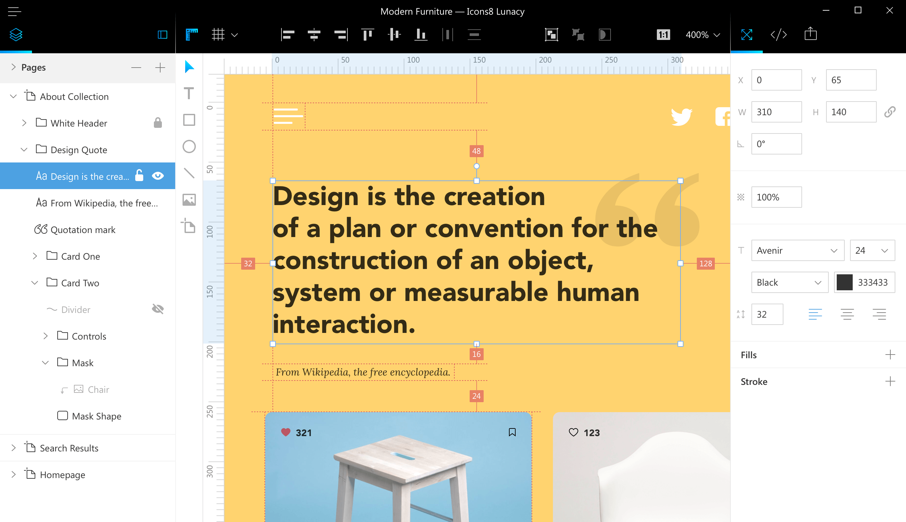

# Features

Lunacy is a native Windows app that works offline and supports .sketch files.

## Sketch Compatibility

Lunacy is compatible with .sketch format. In particular, you can:

### Read .sketch Files of any Version

This is important, as Sketch completely changed the format in version 43, and kept migrating it to the new format until the version 50.

* If you've downloaded an old UI kit from [Sketchappsources](https://www.sketchappsources.com/), Lunacy will read it.

* If you have a file sent by your teammate that uses the last version of Sketch, Lunacy will read it.

* If Sketch changes the format again, we'll update Lunacy. We are members of the so-called "Friends of Sketch" group and get the early builds, so we fix it before the release.

* We also work on reading the slightly broken files generated by [PSD to Sketch](https://avocode.com/convert-psd-to-sketch/?lng=en) Converter (they have non-unique IDs).

### Save .sketch Files

We save the files in .sketch format. We preserve the original structure: naming, groups, and IDs.

As of the version 3.7, _Lunacy doesn't fully support the symbols_. We save the symbols as the generic groups. Your designs look the same, but updating a symbol won’t affect its instances.

### Tools, Objects, and Properties

We cover all the data structures of Sketch, including masks, gradients, rounded corners, curves, sophisticated text formatting, and many more.

## Full Editor

### Create New Design

You can create the new designs with Lunacy. Also, it’s a perfect tool for prototyping. You can add simple shape elements to your layout (such as draw oval, rectangle, line, or add a bitmap), draw, align, and join objects.

### Modify Existing Design

Lunacy is a full-fledged editor which allows you to modify existing design.

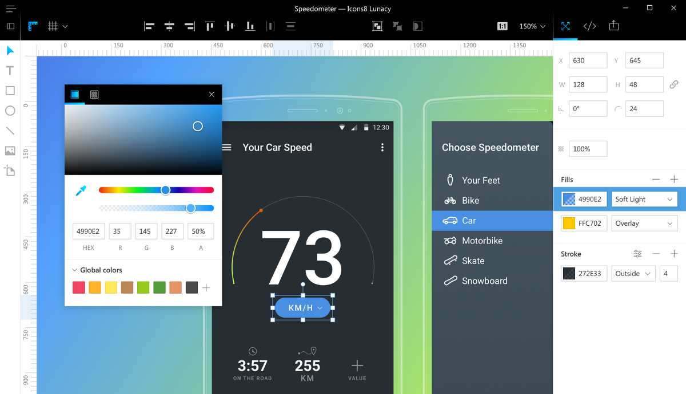

### Generate Source Code

Lunacy allows you to see CSS and XAML code of elements.

### Export Assets

You can export any assets from your document in PNG, SVG, XAML.

Exclusive feature: upload directly to a CDN. Lunacy generates a CDN link for you without any extra effort from your side.

# Interface

Lunacy's interface is minimal. It contains only essential controls so you won’t spend much time learning how to interact with it.

The interface is built from the following blocks:

* The **toolbar** along the top which contains high-level tools and actions.
* The **objects** are the pane on your left which contains all the **artboards** of your document.
* The **inspector** on the right which lets you see and adjust the properties of the selected object or layer.
* The **canvas** in the middle is a place where you will see your designs.

There are no floating panels. That way you always have a completely unobscured view of your сanvas.

## List of Objects

The Artboard and Objects is the pane on your left. On the top level, there are the **artboards**. Artboard is a fixed frame inside the canvas. Usually, designers create a new artboard for each new web page, mobile screen, banner ad, or any other artwork. The use of artboards is optional; you can draw directly on the canvas.

Inside the artboards, there are objects. Here you can see each object's attributes, such as whether it’s hidden or locked, as well as reorganize layers by renaming and re-ordering them.

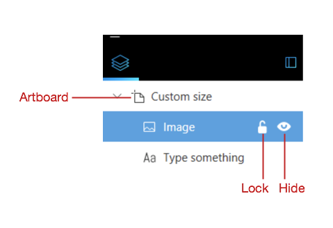

Any object or group of objects can be hidden from the canvas by clicking on the eye icon that appears on the screen when you click on the object. Alternatively, it's possible to hide an element using keyboard shortcut **Ctrl + H.**

A padlock icon is used to lock the layer on canvas, meaning it cannot be selected or moved without being unlocked first. Alternatively, it's possible to lock an object using keyboard shortcut **Ctrl + L**

## Object Tools

The toolbar contains elements you need to create your design. Those include:

<table>
  <tr>
    <td>Object</td>
    <td>Keyboard shortcut</td>
  </tr>
  <tr>
    <td>Text</td>
    <td>T</td>
  </tr>
  <tr>
    <td>Rectangle </td>
    <td>R</td>
  </tr>
  <tr>
    <td>Oval</td>
    <td>O</td>
  </tr>
  <tr>
    <td>Line</td>
    <td>L</td>
  </tr>
  <tr>
    <td>Bitmap</td>
    <td>P</td>
  </tr>
  <tr>
    <td>Avatar</td>
    <td>Ctrl + P</td>
  </tr>
  <tr>
    <td>Artboard</td>
    <td>A</td>
  </tr>
</table>

Some of these shapes have extra options, such as the ability to add stokes or round corners.

## Rulers and Grids

Rulers (keyboard shortcut **Ctrl + R**) and grids (keyboard shortcut **Ctrl + '**)will help you position objects exactly where you want them. Grid allows you to align objects to a particular layout.

**Note:** Rulers and grids are not part of your design, and won't appear on exported designs.

Lunacy has support for a regular (square) grid. Users have a few options to choose from - a range of grids starts from a 4x4 grid to 64x64.

## Artboard

Artboard is where you see your designs. Lunacy provides a lot of predefined sizes for the artboard starting from the size of iWatch to the Full HD layouts. You can modify the size of an artboard afterward.

It's possible to add a few artboards inside the canvas. For example, when designing a landing page, many designers create an Artboard for desktop and mobile version of a landing page.

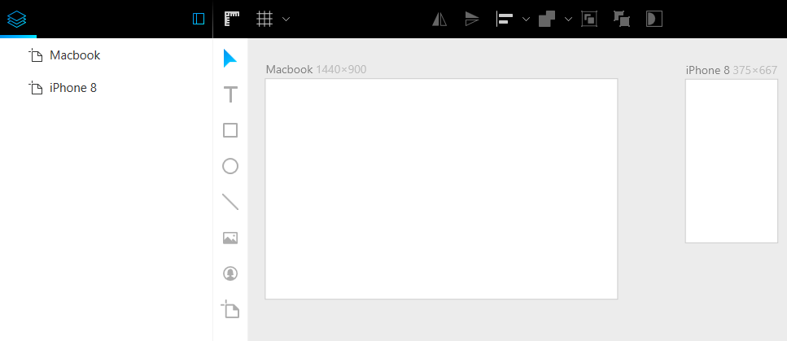

## Inspector

The Inspector on the right lets you adjust the properties of the selected object.

## Zoom

The Zoom lets you see more or less of your document depending on the zoom level. You can change zoom factor from 25% to 800%.

In practice, designers use the shortcuts **Ctrl + '+' and Ctrl + ‘-’**. **Ctrl + ‘0’** resets the zoom level to 1:1.

[//]: # (### Zoom to Area)

# Editing

## Selecting

Selecting objects in Lunacy is easy: you just click an object on the canvas. Once the object is selected, you should see eight little handles; one in each corner and one in the center of each edge.

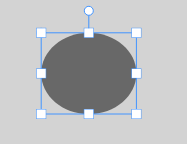

Alternatively, you can use the Layer List to select an object. Clicking an object's name in the list selects it on the canvas.

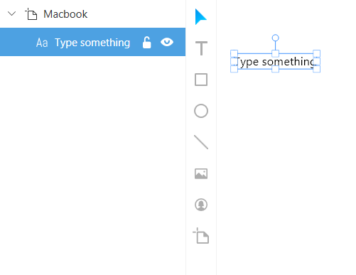

You can select multiple objects by holding down the Shift key on the keyboard and click on another object.

Selecting Group vs. Object

If you click an object within a group, Lunacy selects the whole group. Usually, it's handy: you can move around the whole components.

Sometimes you need to choose an object though. To do so, hold Ctrl when selecting the object.

## Adding

The most common type of objects in your document is shapes. The easiest way to add a shape is to pick one of the standard shapes from the toolbar. There is a wide variety of default shapes provided with Lunacy such as ovals, rectangles, lines and more.

[//]: # (there was a weird broken table here; I removed it  - IB)

## Moving

### Moving With Keyboard

* Click the arrow keys to move by one pixel
* Shift+Arrow moves by 10 pixels

Using keyboard is handy when you either

* Need precision
* Or need to move an object just a little bit (we, designers, spend 50% of our time making small adjustments)

### Moving Horizontally and Vertically

Hold Shift while moving an object. Lunacy locks one of the axis and move object either horizontally or vertically.

## Duplicating

Hold Alt and move the object. Lunacy will create a copy.

Another way to create a copy is pressing Ctrl+D.

## Grouping

Grouping objects is a way to organize a document. After creating a group, you can move, scale, and duplicate the group as a single object.

Designers use grouping a lot. One can say, designer turn the documents into a series of the nested groups.

## Resizing

Each object in Lunacy has eight handles that become visible when you select objects. Those handles don't just indicate selection; you can also use them to resize a layer. Grab any of the handles and drag them to resize an object.

[//]: # (this piece must go somewhere else - ib)

[//]: # (Using Lunacy it's possible to view properties of objects. You need to select an object to see it’s properties in the right panel.)

[//]: # (this resizing option is called somehow else - ib)

Notice the Resizing option.

Imagine you've got an object inside a group. When you resize this group, how the object should behave? Should it resize or stay locked?

For example, when _Fix Height_ is enabled, the height remains intact when you resize the parent vertically.

You only see this option if you selected an object inside a group or an artboard.

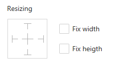

## Rotating

You can rotate an object using the rotate clock.

As rotation is a value measured in degrees, it can be edited via Lunacy's inspector.

## Z-Axis Position

Each object in artboard can be located on Z-axis. It's possible to
* bring an object forward (keyboard shortcut **Ctrl + J**)
* bring an object to the front (keyboard shortcut **Shift+Ctrl+J**)
* send an object backward  (keyboard shortcut **Ctrl + [**)
* or send an object to back (keyboard shortcut **Shift + Ctrl + [**)

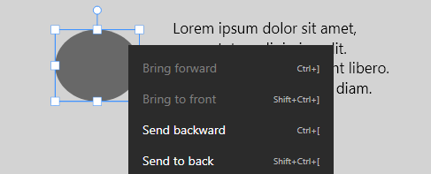

## Align and Distribute

In a bar at the very top of the canvas are the buttons for aligning and distributing objects. These buttons become active when you have more than one object selected.

| Button | Action | Shortcut |
|---|---|---|---|---|
|  | Flip horizontally | Ctrl + ←, Ctrl + → |
|   | Flip vertically | Ctrl +↓, Ctrl +↑ |
|  | Align | None |
|  |Group| Ctrl + G |

## Edit Shape

For some objects like rectangle, it's possible to edit the shape. To activate edit shape mode, you need to double-click on the object. This option allows you to modify properties like corner radius for a rectangle.

# Objects

Lunacy supports the typical tools for any vector editor.

<table>
  <tr>
    <td>Object</td>
    <td>Keyboard shortcut</td>
  </tr>
  <tr>
    <td>Text</td>
    <td>T</td>
  </tr>
  <tr>
    <td>Rectangle </td>
    <td>R</td>
  </tr>
  <tr>
    <td>Oval</td>
    <td>O</td>
  </tr>
  <tr>
    <td>Line</td>
    <td>L</td>
  </tr>
  <tr>
    <td>Bitmap</td>
    <td>P</td>
  </tr>
  <tr>
    <td>Avatar</td>
    <td>Ctrl + P</td>
  </tr>
  <tr>
    <td>Artboard</td>
    <td>A</td>
  </tr>
</table>

Let us review some of these tools in detail.

## Square

If you need a square, choose the Rectangle tool and hold shift while drawing.

## Circle

## Straight Lines

## Text

You can add text by choosing the Text tool from the Shapes and Objects toolbar (or press **T**). The pointer changes to the Text Input tool icon and then you can click anywhere in the Canvas to insert your text layer at that point. When you click on a canvas, a new text layer will be inserted with "Type something" placeholder, ready to replace.

When you have a text layer selected, you shall notice that the Inspector has changed to show you all the properties that apply to text. Underneath the standard object properties, there’s the area for text style options which includes:

* Font family
* Font size
* Font weight
* Font color
* Line spacing
* Alignment options

## Missing Fonts, Solved

When working with Sketch files downloaded from the internet, or received from a colleague, it may contain fonts that are missing on your system.

### Auto Downloading

If you open a file with missing fonts, Lunacy checks Google Fonts and download those that are missing. The process is so smooth you never even notice it.

### Auto Installation

All the Google Fonts are already on the list. When you choose any of them, Lunacy downloads it from the Google service. Smooth!

### Auto Replacing

In Lunacy, you can replace the font once for the whole document while other editors require to do it for every font instance.

[//]: # (Maybe we should cut the above into couple sentences - ib)

## Bitmaps

Bitmaps, or images are one of the object types that are supported in Lunacy. Bitmaps, (or raster) images are made up of pixels; those images can take many forms, such as screenshots or photographs. Lunacy supports the most common image formats such as PNG, JPG, JPEG.

## Avatar Tool

Designing user interfaces, one of the common tasks is creating avatars. This time-consuming process is easy with Lunacy. It has a tool for that. The avatar tool lets you create the one in one click.

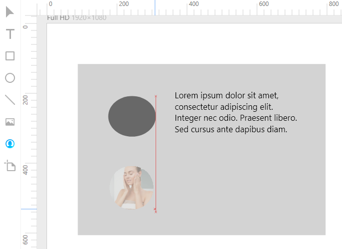

## Masks

The masks (keyboard shortcut **Ctrl + M**) in Lunacy are used to show parts of objects selectively.. For example, masking two overlapping ovals gives you an oval image.

Before masking:

After masking

# Styling

You can change styling options for each object of your document. All styling properties for objects are available in Inspector. If you decided to remove styling, you need to select an object and click the '-' button.

## Color Picker

Choosing, saving colors

## Gradients

Create and edit gradients.

Following types of gradient are supported:

* Linear gradient

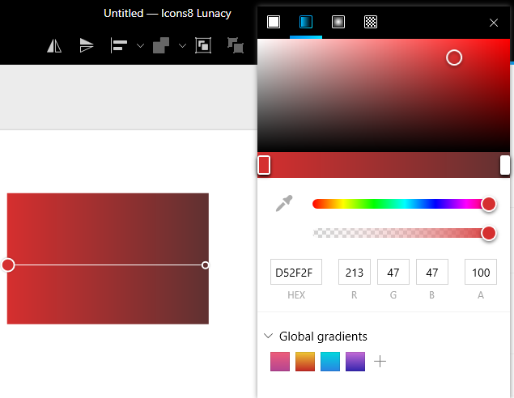

* Radial gradient

## Effects

Effects need more explanation. Combining effects. Blending modes.

## Shadows

When Shadow is enabled for the object, it will cast outside of the shape. It's possible to define shadow’s X and Y position, blur radius, spread, and color.

## Strokes

All objects except text layers can contain strokes. These can all have various thicknesses, colors, and blend modes.

Border position can be center, inside or outside.

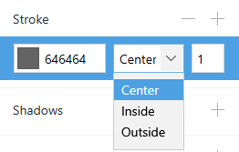

Applying 10px stroke for rectangle object: original object, center stroke, inside stroke, outside stroke

## Gaussian Blur

Gaussian blur is a blur type that will accurately blur in all directions.

## Formulas

Inspector supports **formulas**. Type anything from 2+2 to complex algebra.

You can **drag the values** up and down; they will increase or decrease.

## Rounded Corner Hack

You can specify the radius for each corner separately. To do so, type 4 values divided by space.

This property is especially handy for tabs.

## Margins and Distances

Lunacy shows margins and distances between elements.

# Export

## Exporting Individual Assets

When designing icons, mobile app layouts, web pages, or anything else in Lunacy, you'll likely want to export parts of your creation or even all of it! With Lunacy, it’s simple to mark what you want to export, and how you want it exported.

Simply click on  item in the top toolbar and select the object (or objects) that you want to export.

You can export your assets either to PNG or SVG format.

For PNG format you can choose a size or scale in which an element will export. The default size is '1x', which will export your layer at the actual size it was created. If you’re designing for mobile, you may want to export something at double or even triple the size you created it, in this case, ‘2x’ and ‘3x’.

## Publish to CDN

Lunacy allows you to publish assets directly to the web. Your image will be hosted on the fast servers in the multiple regions of the world, assuring the quick delivery.

<iframe style="margin: 30px 0;" width="739" height="416" src="https://www.youtube.com/embed/T3vMZPxsQQs" frameborder="0" allow="autoplay; encrypted-media" allowfullscreen></iframe>

Instead of saving an image to a disk, you can get its URL with a single click, ready to insert into your HTML. Lunacy uploads the file to Icons8 CDN servers.

The service is free thanks to the generous sponsorship of [KeyCDN](https://www.keycdn.com/).

The export works in one-click. Simply select Export option and click 'Get CDN Links.' That’s all!

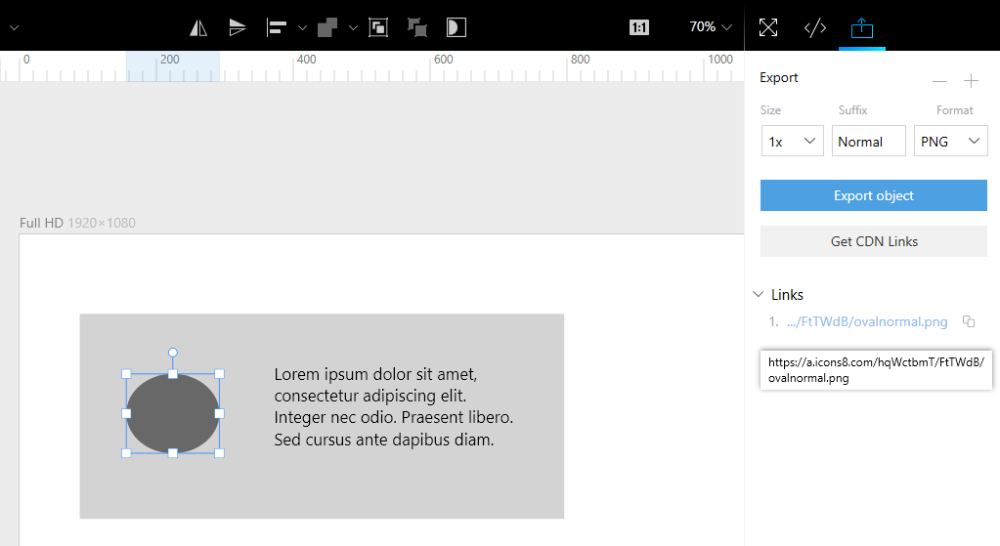

## Code Preview

Lunacy allows preview CSS and XAML code of all objects in a document. This feature is ideal for web designers. If you click on </> item in the top tab bar and select any element in the canvas, you'll see CSS/XAML code for this object in the right panel. It’s possible to copy code properties in one click.

## Publishing Design

Lunacy integrates with [Sketch the Ripper](http://sketch.the.ripper.graphics/)—a fast and rustic alternative to the advanced (and expensive!) tools like Zeplin, Avocode, or Simply. It allows you to smooth design handoff.

Imagine you are a designer who finished working on a piece. Instead of sending a .sketch file to your teammates, you share your designs with a single click and get a link to all the assets ripped off ([check this example](http://sketch.the.ripper.graphics/g3tkgj/music-final)). It sets a shortcut from design to development without the need of additional viewers.

[//]: # (removed the unique features section - maybe we should recreate it as a set of links)
[//]: # (# Unique Features)

# Shortcuts

You can use keyboard shortcuts in Lunacy to help speed up your design process.

We keep these shortcuts consistent with both Sketch for Mac and Photoshop. If you are used to the certain combinations, probably they will work here.

You can use keyboard shortcuts to help speed up your design process. Commands are divided into several sections.

## General Shortcuts

| Action        | Hotkey(s)     |
| ------------- |:-------------:|
| Open |Ctrl+O |
| New |Ctrl+N |
| Save |Ctrl+S |
| Save as |Shift+Ctrl+S |
| Export |Ctrl+E |
| About |F1 |
| Exit |Alt+F4, Ctrl+Q |
| Copy |Ctrl+C |
| Cut |Ctrl+X |
| Paste |Ctrl+V |
| Undo |Ctrl+Z  |
| Redo |Ctrl+Y, Ctrl+Shift+Z |
| Toggle rules |Ctrl+R |
| Toggle grid |Ctrl+’ |
| Toggle left panel |Ctrl+T |

## Inserting Objects

| Action        | Hotkey(s)     |
| ------------- |:-------------:|
| Rectangle |R |
| Oval |O |
| Line |L |
| Text	|T |
| Artboard |A |
| Draw from center | Alt+Drag |
| Draw lock aspect |Shift+Drag |
| Select |S, Esc |
| Insert bitmap |P |
| Create avatar |Ctrl+P |

## Selecting Objects

| Action        | Hotkey(s)     |
| ------------- |:-------------:|
| Select layer |Click |
| Select all |Ctrl+A |
| Select all Artboards |Shift+Ctrl+A |
| Select in group |Ctrl+click |

## Editing Objects

| Action        | Hotkey(s)     |
| ------------- |:-------------:|
| Sape edit mode |Enter, double click |
| Finish editing |Escape |
| Delete layer |Backspace, Del |
| Toggle mask |Ctrl+M |
| Flip horizontaly |Ctrl+→, Ctrl+← |
| Flip vertical |Ctrl+↑, Ctrl+↓ |
| Union |Shift+Ctrl+U |
| Substract |Shift+Ctrl+P |
| Intersect |Shift+Ctrl+I |
| Difference |Shift+Ctrl+X |
| Align left |Shift+Ctrl+← |
| Align horizontally |Shift+Ctrl(+)- |
| Align right |Shift+Ctrl+→ |
| Align top |Shift+Ctrl+↑ |
| Align vertically |Shift+Ctrl+\| |
| Align bottom |Shift+Ctrl+↓  |
| Distribute horizontally |Shift+Ctrl+H |
| Distribute vertically |Shift+Ctrl+V |

## Text Editing

| Action        | Hotkey(s)     |
| ------------- |:-------------:|
| Bold |Ctrl+B |
| Italic  |Ctrl+I |
| Increase font size |Ctrl(+)+ |
| Decrease font size |Ctrl(+)– |

## Moving and Resizing Objects

| Action        | Hotkey(s)     |
| ------------- |:-------------:|
| Distances from objects |Alt |
| Duplicate |Alt+Drag, Ctrl+D |
| Move long X/Y axis |Shift+Drag |
| Move by 1px |Arrow keys |
| Move by 10px |Shift+Arrow keys |
| Resize from center |Alt+resize |
| Preserve ratio |Shift+resize |
| Move canvas |Space+Drag |

## Arranging Objects

| Action        | Hotkey(s)     |
| ------------- |:-------------:|
| Group selection |Ctrl+G |
| Ungroup selection |Shift+Ctrl+G |
| Bring forward |Ctrl+\[ |
| Bring to front |Shift+Ctrl+\[ |
| Send backward |Ctrl+] |
| Send to back |Shift+Ctrl+] |
| Hide/show |Ctrl+H |
| Lock/unlock |Ctrl+L |

## Zoom and Focus

| Action        | Hotkey(s)     |
| ------------- |:-------------:|
| Zoom |Ctrl + Mouse Wheel |
| Zoom In |Ctrl(+)+,+ |
| Zoom Out |Ctrl(+)-,- |
| Zoom to 100% |Ctrl+0 |
| Zoom to all elements |Ctrl+1 |
| Zoom to selection |Ctrl+2 |
| Fit width |Ctrl+3 |
| Fit height |Ctrl+4 |

# FAQ

### Question: Will Lunacy work on Linux?

It's quite an option, though requires additional development. If you’re willing to contribute, please check [this thread](https://lunatics.icons8.com/ideas/1/version-for-linux).

### Question: Do I need internet connection to use Lunacy?

No, Lunacy doesn't need a connection to the internet.

### Question: How about being Open Source?

Short answer: not at the moment, not all of it.

Long answer: Certainly, that would speed up the development.

On the other hand, it will slow it down too. Sometimes, a small team can advance more than a big community, especially in the beginning. We may reconsider it in the future.

If you are willing to contribute, you may want to create the interface for Linux. Check [this thread](https://lunatics.icons8.com/ideas/1/version-for-linux).

### Question: How much will you plan to charge for Lunacy?

 Nothing. Lunacy is completely free (no hidden charges, no ads, no locked features).

### Q: How would I know when to update Lunacy?

Windows Store version updates silently. If not, check if you [have](https://support.microsoft.com/en-gb/help/15081/windows-turn-on-automatic-app-updates) the automatic updates on. We recommend this option.

### Q: Once there are updates, will I have to reinstall Lunacy, or do they install automatically?

If you installed Lunacy with a downloadable installer, it will notify you about the update with an alert in the window title.

In any case, you can check our [release notes](https://docs.icons8.com/release-notes/).

# Support

* **[Community Support](https://community.icons8.com/)** — our forum. The whole development team is helping you too.

* **[Feature Requests](https://lunatics.icons8.com/)** — a board similar to UserVoice. Vote for features and propose yours. One feature per post, please.

* **[Improving This Manual](https://github.com/icons8/lunacy-docs/blob/master/docs/index.md)** — please help us! We'll accept the pull requests for fixing the errors, expanding the sections, and updating it with new features (Icons8 team lags a little between adding a feature and writing the documentation for it). 

* **Saying hello** — our [Lunacy page](https://icons8.com/lunacy) has the comments in the bottom. If you have a review of our work or just want to say hello, you're welcome!

* **[Lunacy in the Windows Store](https://www.microsoft.com/en-us/p/lunacy/9pnlmkkpcljj)** — we depend your honest feedback. Please vote and leave a review so more people will know about Lunacy. Thank you 🙏🏽

