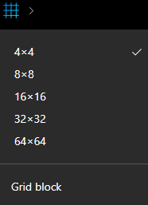
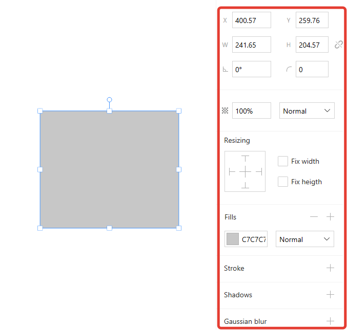
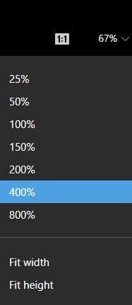

---
# Page settings
layout: default
keywords:
comments: false

# Hero section
title: Interface
description: Learn about interface layout and navigation tools
icon: 'toggle-off'

# Micro navigation
micro_nav: false

# Page navigation
page_nav:
    next:
        content: Editing
        url: '/editing'
    prev:
        content: About
        url: '/about'
---

Lunacy’s interface is minimal. It contains only essential controls, so you don’t have to spend much time learning how to interact with it.

The interface is built using the following blocks:

* The **toolbar** along the top, which contains high-level tools and actions.
* The **objects** are the pane on your left, which contains all the **artboards** of your document.
* The **inspector** on the right, which lets you see and adjust the properties of the selected object or layer.
* The **canvas** in the middle is where you will see your work.

There are no floating panels. That way you always have a completely unobscured view of your сanvas.

## List of Objects

The Artboard and Objects is the pane on your left. On the top level, you will find **artboards**. Artboard is a fixed frame inside the canvas. Designers usually create a new artboard for each new web page, mobile screen, banner ad, or other type of artwork. The use of artboards is optional; you can also draw directly on the canvas.

Inside the artboards, there are objects. Here you can see each object’s attributes, such as whether it’s hidden or locked;  you can also re-organize layers by renaming and re-ordering them.

Any object or group of objects can be hidden from the canvas by clicking on the eye icon that appears on the screen when you click on the object. Alternatively, you can hide the element using the keyboard shortcut `Ctrl` `H`.

A padlock icon is used to lock the layer on your canvas, meaning it cannot be selected or moved again without being unlocked first. Alternatively, you can lock an object using the keyboard shortcut `Ctrl` `L`

## Object Tools

The toolbar contains the elements you need in order to create your design. These include:

<table>
  <tr>
    <td>Object</td>
    <td>Keyboard shortcut</td>
  </tr>
  <tr>
    <td>Text</td>
    <td>`T`</td>
  </tr>
  <tr>
    <td>Rectangle </td>
    <td>`R`</td>
  </tr>
  <tr>
    <td>Oval</td>
    <td>`O`</td>
  </tr>
  <tr>
    <td>Line</td>
    <td>`L`</td>
  </tr>
  <tr>
    <td>Bitmap</td>
    <td>`P`</td>
  </tr>
  <tr>
    <td>Avatar</td>
    <td>`Ctrl` `P`</td>
  </tr>
  <tr>
    <td>Artboard</td>
    <td>`A`</td>
  </tr>
</table>

Some of these shapes have extra options, like the ability to add stokes or round corners.

## Rulers and Grids

Rulers (keyboard shortcut `Ctrl` `R`) and grids (keyboard shortcut `Ctrl` `'`)will help you position objects exactly where you want them. The grid allows you to align objects to a particular layout.

Note: Rulers and grids are not part of your design, and won't appear on your exported design.

Lunacy offers support for a regular (square) grid. Users have a number of options to choose from; the range of grid sizes start from 4x4, and goes up to 64x64.

## Artboard

The artboard is where you will see your designs. Lunacy provides a variety of predefined artboard sizes to choose from. These start from the size for iWatch and goes up to Full HD sized layouts. You can modify the size of an artboard after creating it.

In Lunacy you have the ability  to add more than one artboard inside a canvas. For example, when designing a landing page, many designers create one artboard for the desktop as well as mobile version of the page.

## Inspector

The Inspector on the right lets you adjust the properties of the selected object.

## Zoom

The Zoom lets you see a larger or smaller part of your document depending on the zoom level. You can change the zoom scale of your document from 25% to 800%.

In practice, designers use the shortcuts `Ctrl` `+` and `Ctrl` `-`. The shortcut `Ctrl` `0` resets the zoom level to 1:1.

[//]: # (### Zoom to Area)