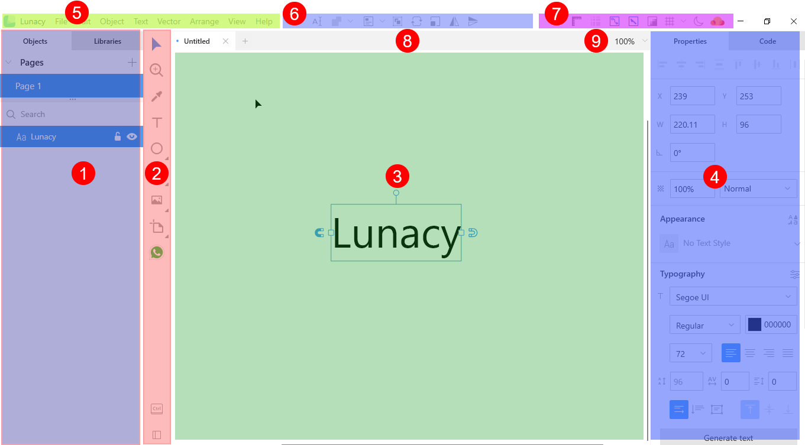
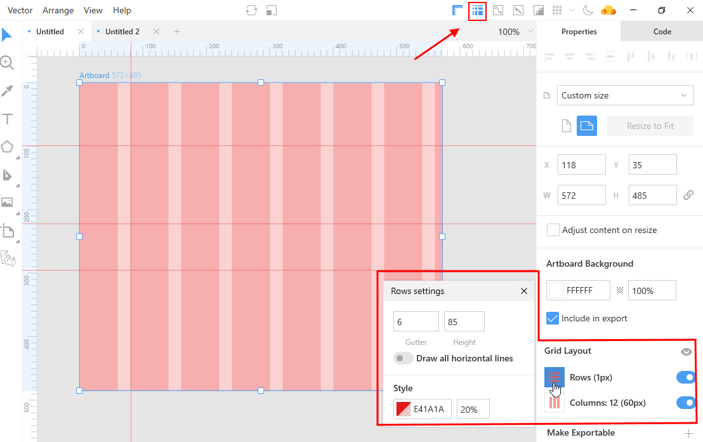
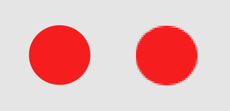

---
# Page settings
layout: default
keywords:
comments: false

# Hero section
title: Interface
description: Get familiar with the Lunacy interface
icon: 'toggle-off'

# Micro navigation
micro_nav: false

# Page navigation
page_nav:
    next:
        content: Tools
        url: '/tools'
    prev:
        content: About
        url: '/about'
---

## Overview

The Lunacy interface is minimal. It contains only essential controls, so you don’t have to spend much time learning how to interact with it.

{:.is-big}

The interface consists of the following main elements.

1. The left panel. Features two tabs:

    * **Objects**: Shows the list of pages in the current document and the list of objects on the selected page. For details, read [below](#the-objects-panel).
    * **Libraries**: Provides access to the document assets (<a href="https://docs.icons8.com/symbols" target="_blank">symbols</a>, layer and text <a href="https://docs.icons8.com/layerstyles/" target="_blank">styles</a>), built-in <a href="https://docs.icons8.com/libraries/" target="_blank">libraries</a> of icons, photos and vector images, as well as built-in and external <a href="https://docs.icons8.com/libraries/#ui-kits" target="_blank">UI kits</a>.

2. The **toolbar**. Features all the primary Lunacy tools. For details about tools, click <a href="https://docs.icons8.com/tools/" target="_blank">here</a>.
3. The **canvas**. That is your working area. For details, read [below](#the-canvas).
4. The **Inspector** panel. Features two tabs:

    * **Properties**: Lets you see and adjust the properties of the selected object. The view of the Properties Inspector varies with the type of the selected object. For details, read [below](#the-inspector).
    * **Code**: Allows you to view and copy the code of the selected object in CSS, XAML and SVG.
5. The **menu bar**. Holds the options and commands related to files, objects, editing, etc.
6. The **context toolbar**. The set of controls that appears on the context toolbar depends on the type of the currently selected object. Hover the cursor over a tool icon to see a pop-up explaining what the tool does.
7. The **action bar**. Features a set of buttons related mostly to display options, see the table below.
    
    <table>
    <thead>
        <tr>
        <th>Button</th>
        <th>Description</th>
        <th>Keyboard shortcut/Menu option</th>
        </tr>
    </thead>
    <tbody>
        <tr>
        <td></td>
        <td> The <b>Show/Hide rulers</b> button. Controls the display of rulers. For details, read <a href="https://docs.icons8.com/interface/#rulers-and-guides">below</a>.</td>
        <td><code>Ctrl + R</code></td>
        </tr>
        <tr>
        <td></td>
        <td>The <b>Layout</b> button. Controls the display of the layout grid. Available only when there is an artboard on the canvas. For details, read <a href="https://docs.icons8.com/interface/#layout-grid">here</a>.</td>
        <td><code>Ctrl + \</code></td>
        </tr>
        <tr>
        <td></td>
        <td>The <b>Show prototyping</b> button. Controls the display of <a href="https://docs.icons8.com/tools/#hotspot-tool" target="_blank">hotspots</a>.</td>
        <td><b>View > Prototyping</b></td>
        </tr>
        <tr>
        <td></td>
        <td>The <b>Show pixels on zoom</b> button. Enables the display of pixels when the zoom value exceeds 100. For details, read  <a href="https://docs.icons8.com/interface/#show-pixels-on-zoom">here</a>.</td>
        <td><b>View > Pixels on Zoom</b></td>
        </tr>
        <tr>
        <td></td>
        <td>The <b>Show grid</b> button. Enables the display of the square grid. For details, read <a href="https://docs.icons8.com/interface/#square-grid">here</a>.</td>
        <td><code>Ctrl+'</code></td>
        </tr>
        <tr>
        <td></td>
        <td>The <b>Enable dark mode</b> button. Turns on/off the night theme in the Lunacy interface.</td>
        <td><code>-</code></td>
        </tr>
        <tr>
        <td></td>
        <td>The <b>Sketch Cloud</b> button. Opens the Sketch Cloud panel. For details about working with Sketch Cloud in Lunacy, read <a href="https://docs.icons8.com/cloud/" target="_blank">here</a>.</td>
        <td><code>-</code></td>
        </tr>
        <tr>
        <td></td>
        <td>The <b>Missing fonts button</b> button. Appears when the file you are working with includes fonts not installed on you computer. For details, read <a href="https://docs.icons8.com/text/#missing-fonts" target="_blank">here</a>.</td>
        <td><code>-</code></td>
        </tr>
        <tr>
        <td></td>
        <td>The <b>Notifications</b> button. Appears when you have a new notification from Lunacy. Opens the panel where you can view and manage Lunacy notifications.</td>
        <td><code>-</code></td>
        </tr>
    </tbody>
    </table>

8. The **file tabs panel**. Shows the tabs of currently open files. To switch between the files, just click the respective tab.
9. The **zoom control**. For details, read [below](#zooming-options).

## [The Objects panel](#the-objects-panel)

### Document pages

Each document can include any number of pages. You can keep all you work on a single page or split it into several pages by components, if the project is large. For instance, if you are designing a website, you can opt to keep the desktop and mobile versions on separate pages. Or you can duplicate a page to save a snapshot of your current work and continue working the copy. In fact, the reasons for having multiple pages in a document are numerous and it is completely up to you to decide what approach to choose. The figure below shows a view of a page list.

The operations that you can perform with document pages include:

* Adding pages
* Changing the order of pages
* Renaming pages
* Duplicating pages and their content
* Copying and pasting pages and their content between documents
* Deleting pages

To add a new page to the document:

1. Click the plus icon in the **Objects** panel.
2. Enter the name of the new page.
3. Press `Enter`.

To change the position of a page in the list, just drag it up or down to where you want it.

The rest of the operations are accessible through the context menu invoked by a right-click over the required page name.

<video autoplay="" muted="" loop="" playsinline="" width="" poster="/public/tool-pagesplaceholder.png" height="auto"><source src="/public/interface-pages.mp4" type="video/mp4"></video>

There is also a special type of a page - the Symbols page. For details, read <a href="https://docs.icons8.com/symbols/#symbols-page" target="_blank">here</a>.

### Objects list

The object list shows all the objects and object groups available on the current page. Lunacy automatically assigns names to objects and object groups as you create them, but you can rename them if you like. The figure below shows a view of an object list.

{:.is-big}

The operations that you can perform in the objects list include:

* Selecting objects - to select an object or object group, click its name in the objects list. As you do it, the selection frame appears around the object on the canvas. To select multiple items hold down the `Ctrl` or `Shift` keys and click.
* Searching for objects - to quickly find the required object start typing its name in the search field above the object list.
* Arranging objects - by default Lunacy adds newly created objects to the top of the list. To arrange objects in the list, drag them up or down.
* Hiding objects - by hiding you can temporarily remove the selected item from the canvas. You can hide objects, object groups or individual items within object groups. Select the item in the list and click the eye icon that will appear next to its name. You can also hide objects by using the `Ctrl+H` shortcut or the respective command on the context menu.
* Locking objects - by locking objects you can protect them from accidental edits. You cannot select a locked object on the canvas. But you still can select it through the objects list and edit its properties in the Inspector. You can also lock grouped objects or individual objects within a group. Select the object in the list and click the padlock icon that will appear next to its name. You can also lock objects by using the `Ctrl+L` shortcut or the respective command on the context menu.
* Other basic operations with objects available on the context menu.

<video autoplay="" muted="" loop="" playsinline="" width="" poster="/public/tool-objectlistplaceholder.png" height="auto"><source src="/public/interface-pages.mp4" type="video/mp4"></video>

**Tip:** Some projects, such as design systems, can house hundreds of objects on a single page. To quickly locate the required object on the canvas, find it by typing its name in the search field, select it in the objects list and then press `Ctrl + 2` (Fit to selection).

## [The Canvas](#the-canvas)

The canvas is your working area. It has no boundaries, so you can add objects wherever you want. But if you need to observe certain frames you can add <a href="https://docs.icons8.com/tools/#artboard-tool" target="_blank">artboards</a> to the canvas. Also, you can toggle on and off the display of [rulers](#rulers-and-guides) and [grids](#grids) on the canvas.

### [Rulers and guides](#rulers-and-guides)

Ruler and guides will help you position and align objects on the canvas. In Lunacy, rulers are enabled by default. They appear at the top and on the left side of the canvas. The default and the only measurement unit is pixels. To toggle the rulers off/on, use the `Ctrl+R` shortcut or do it through the menu bar (**View** > **Rulers**).  

To create a guide, click anywhere on a ruler and drag the guide onto the canvas to where you need it. Now you can position objects along the guide. Move an object close to the guide and note how it will snap to the guide.

<video autoplay="" muted="" loop="" playsinline="" width="100%" poster="/public/interface-guides.png" height="auto"><source src="/public/inteface-guides.mp4" type="video/mp4"></video>

To relocate a guide, just drag it to another position. If you don't need a guide, click to select it (hold down `Shift` to select multiple guides) and press `Delete`. Also, you can use the options from the pop-up menu invoked by a right-click over a ruler (see the figure below).

### [Grids](#grids)

There are two types of grids: square grid and layout grids. If necessary, you can display both of them at the same time.

#### [Square grid](#square-grid)

If there no artboards on the canvas, Lunacy displays the square grid directly on the canvas (to enable it, just click the **Show grid** button on the action bar). Otherwise, you should enable the display of the grid individually for each artboard.

The procedure is as follows:

1. Select the required artboard. For this, if there are no objects on the artboard, click anywhere on the artboard. Otherwise, click the artboard name at the top of it. Also, you can select it through the object list.
2. Click the **Show grid** button on the action bar.

To select the size of the grid cell, click the down arrowhead next to the button and choose one of the presets or define your custom size as shown in the figure below.

#### [Layout grid](#layout-grid)

You can apply layout grids only to <a href="https://docs.icons8.com/tools/#artboard-tool" target="_blank">artboards</a>. If you have several artboards on a page, the display and the settings of the grid are configured individually for each artboard.

The procedure is as follows:

1. Select the required artboard. If there are no objects on the artboard, click anywhere on the artboard. Otherwise, click the artboard name at the top of it. Also, you can select it through the object list.
2. Click the **Show layout** button on the the action bar. Alternatively, you can click the eye icon in the **Grid layout** section of the Inspector.
3. If necessary, configure the settings of the grid in the Inspector (see the figure below).

{:.is-big}

### Zooming options

#### The Zoom control

To change the zoom value, you can enter the zoom value manually or click the down arrowhead and select one of the preset values or options on the displayed menu (see the figure below).

Another way to adjust the zoom value is to hover the cursor over the zoom control edit field, wait a moment until the cursor turns into a double-headed arrow and then drag the cursor up or down.

Also, for zooming and focusing you can use the <a href="https://docs.icons8.com/tools/#zoom-tool" target="_blank">zoom tool</a>.

#### [Show pixels on zoom](#show-pixels-on-zoom)

By default, Lunacy displays canvas in the vector mode. It means that all objects (except for rasters) will look perfect on the screen irrespective of the zoom value. But if you need to see individual pixels, you can use the *show pixels on zoom* feature. It enables the display of pixels when the zoom value exceeds 100. The figure below shows a view of the same object with the feature disabled (left) and enabled (right).

To toggle on/off the pixel mode, use the **Show pixels on zoom** button () or do it through the menu bar (**View** > **Pixels on Zoom**).

## The Inspector

The Inspector is the panel on the left of the Lunacy interface. The controls and settings that appear in the Inspector depend on the type of object that you select on the canvas. Below is a description of Inspector elements common for almost all object types.

<table>
    <thead>
        <tr>
        <th style="width: 270px;">Inspector element</th>
        <th>Description</th>
        </tr>
    </thead>
    <tbody>
        <tr>
        <td></td>
        <td><b>Alignment and distribution controls</b>. Become available when you select two or more objects.</td>
        </tr>
        <tr>
        <td></td>
        <td><b>Position and size adjustment controls</b>. Allow you to adjust the position and size of the object.</td>
        </tr>
        <tr>
        <td></td>
        <td><b>Resizing constraints</b>. Appear when you select two or more objects, a group of objects or an object on an artboard. Serve to determine the behavior of objects upon resizing.</a></td>
        </tr>
        <tr>
        <td></td>
        <td>The <b>Prototyping</b> section features the settings related to prototyping.</td>
        </tr>
        <tr>
        <td></td>
        <td>The <b>Appearance</b> section allows you to apply <a href="https://docs.icons8.com/layerstyles" target="_blank">styles</a> to the selected object.</td>
        </tr>
        <tr>
        <td></td>
        <td><b>Styling options</b>. For details, read <a href="https://docs.icons8.com/styling" target="_blank">here</a>.</td>
        </tr>
        <tr>
        <td></td>
        <td><b>Export settings</b>. For details, read <a href="https://docs.icons8.com/export" target="_blank">here</a>.</td>
        </tr>
    </tbody>
    </table>
