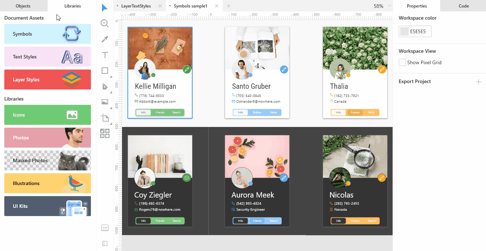
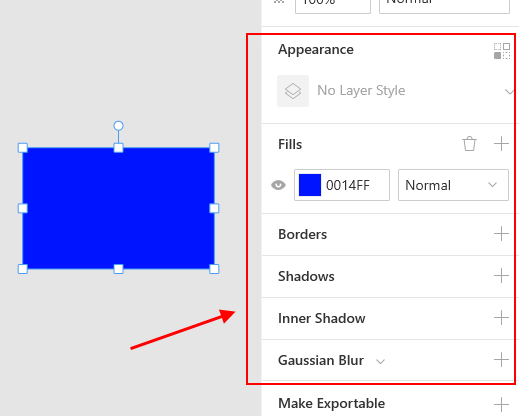
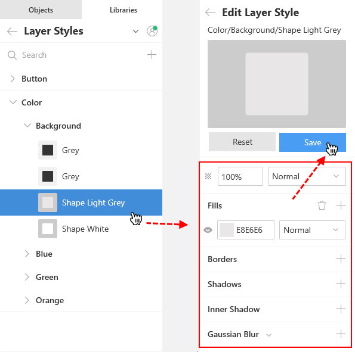
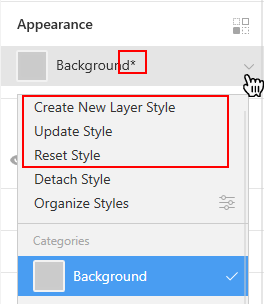
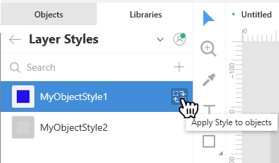
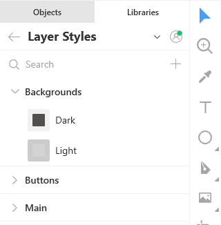
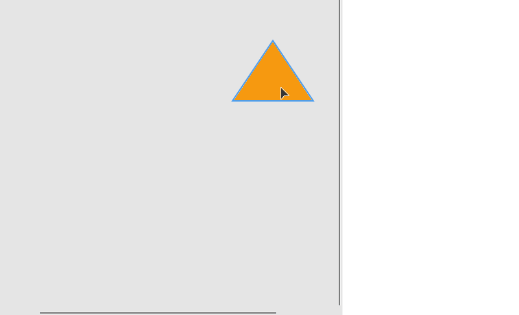
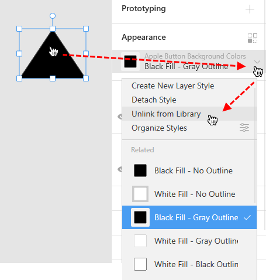

---
# Page settings
layout: default
keywords:
comments: false

# Hero section
title: Layer and text styles
description: Learn how to speed up your work with layer and text styles
icon: 'rich-text-converter'

# Micro navigation
micro_nav: false

# Page navigation
page_nav:
    next:
        content: Libraries
        url: '/libraries'
    prev:
        content: Symbols
        url: '/symbols'
---

Layer and text styles are predefined sets of layer and text properties that you can reuse in your designs. With the help of styles you can dramatically save your time and make your designs look more professional and consistent.  When you modify a style, Lunacy immediately applies them to all the objects using this style.

You will store your custom layer and text styles on the **Libraries** tab.

{:.is-big}

## [Layer styles](#layer-styles)

Layer style properties include:

* Fills
* Borders
* Shadows
* Inner shadows
* Blurs

They appear in the Inspector when you select an object.

For details on styling properties, refer to the <a href="https://docs.icons8.com/styling" target="_blank">Styling</a> section of our documentation.

### Adding a layer style

There are two ways of adding layer styles.

**Way 1.** By clicking the plus icon in the **Libraries** panel and defining all the required properties in the Inspector.

**Way 2.** By first defining the properties of an object and then saving them as a style.

The new style will appear in the **Libraries** panel.

### Modifying a layer style

There are two ways to modify a style.

**Way 1.**

1. In the **Libraries** panel, click the style you want to modify . The **Edit Layer Style** panel appears on the right.
2. Use the panel to make the required changes.
3. Click the **Save** button below the preview window. To discard all changes that you have made but have not saved yet, use the **Reset** button.

**Way 2.**

1. Select an object using the style you want to modify.
2. Make the required changes in the Inspector. When you are done, you will see an asterisk next to the style name in the Inspector. It indicates that changes have been made to the style.
3. Click the down arrowhead next to the style name and select one of the following options on the menu:

    * Update Style: Saves the changes to the existing style.
    * Create New Layer Style: Saves the changes to a new style.
    * Reset Style: Discards all changes that you have made.

### Applying styles to objects

Click the required object and select the style you want to apply to it from the menu in the Inspector.

Optionally, after selecting the object you can click the required style in the left panel and then click the replacement icon as shown below.

You can also apply a style to multiple selected objects at a time.

### Detaching a style

Click the required object and select the **Detach style** command on the menu as shown below.

The appearance of the object remains the same, but it is no longer associated with the style and further changes to the style will not affect the object.

### Organizing styles

It is a good practice to organize styles into categories similar to those shown in the figure below.

To divide your styles into categories, consider the following format of style names:

`Category name / Subcategory name / Style name`  

For example, to organize your styles of backgrounds, you can give them the following names:

* Backgrounds / Light
* Backgrounds / Dark
* etc.

You don't need to manually create categories and subcategories. Lunacy will show them automatically based on style names. The number of nesting levels for subcategories is not limited.

To rename a style:

1. In the **Library** panel, right-click the style and select **Rename** on the displayed menu or press  `F2`, if you prefer shortcuts.
2. Type the new name and press `Enter`.

To rename a style category, right-click the category you want to rename and select the respective command on the displayed menu.

Style categories and styles appear in the A-Z order in the **Library** panel.

To unfold/fold the content of all style categories, right-click anywhere over the category list and select **Expand All/Collapse All** on the displayed menu.

### Duplicating styles

You can duplicate your existing styles and quickly create new ones based on their parents.

To duplicate a style:

* Click the style in the list and press `Ctrl + D`.

    OR
* Right-click the style in the list and select **Duplicate** on the displayed menu.

### Deleting styles and categories

To delete a style:

* Click the style in the list and press `Delete`.

    OR
* Right-click the style in the list and select **Delete** on the displayed menu.

To delete a style category, right-click the category you want to delete and select the respective command on the displayed menu.

## Text styles

Working with text styles is almost the same as with [Layer styles](#layer-styles). The only difference is that in addition to such properties as fills, shadows, etc., text styles also feature a set of typography properties that include font size, font family, line spacing and others.

See also the <a href="https://docs.icons8.com/objects/#text" target="_blank">Objects</a> section for tips on working with text objects.

## External styles

You can make use of layer and text styles from UI kits supplied with Lunacy or your own files. In the latter case you should first add this file to the **UI Kits** library. For details about UI kits, click <a href="https://docs.icons8.com/libraries/#ui-kits" target="_blank">here</a>.

To apply an external style to an object:

1. Select the object on the canvas.
2. In the **Appearance** section of the Inspector, click the down arrowhead to invoke the menu.
3. In the **UI kits** section of the menu, navigate to the required style.

{:.is-big}

You cannot make changes to external styles, but you can use the **Unlink from Library** feature. This feature will add a copy of the style you need to your document assets, i.e. to your layer or text library. After that, you can do whatever you want with the unlinked style as with any other style within your project.

.
