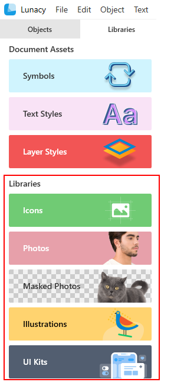
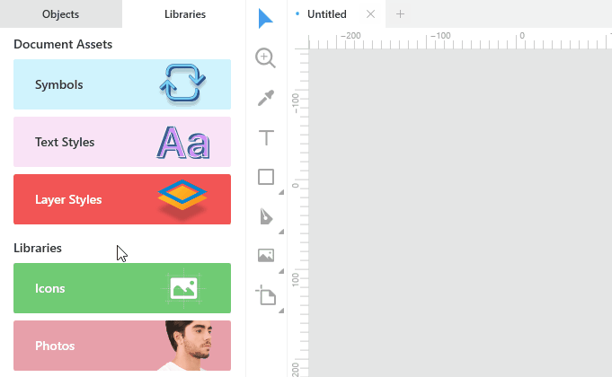
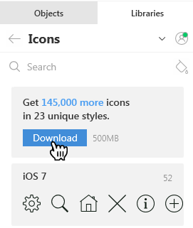
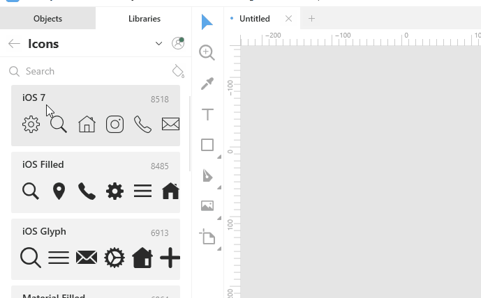
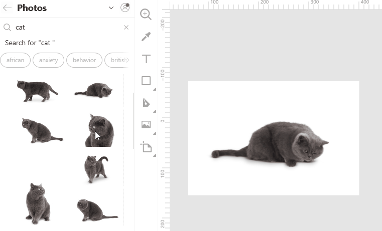
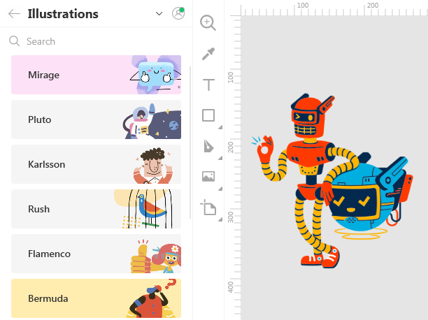
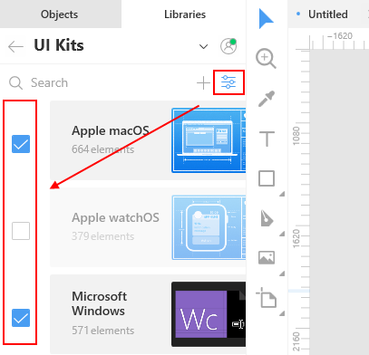

---
# Page settings
layout: default
keywords:
comments: false

# Hero section
title: Libraries
description: How to make use of our built-in icons, photos, images and UI kits
icon: 'book-shelf'

# Micro navigation
micro_nav: false

# Page navigation
page_nav:
    next:
        content: Export
        url: '/export'
    prev:
        content: Layer and text styles
        url: '/layerstyles'
---

One of the cool things in Lunacy is Libraries. Libraries are collections of visual elements that you can add onto your designs in no time. These collections are available on on the **Libraries** tab and include the following:

* Icons
* Photos
* Masked photos (photos with removed background)
* Illustrations
* UI kits

For your convenience, the items inside libraries are organized in categories. Also, to find the required item, you can use the search field at the top of the library tab. Once you've found the item you like, just click it and drag onto the canvas. That's it!

Now you can work with the item in the same way as with any other similar objects.

With some limitations you can use all the library items for free. Speaking in plain words, if you are using our app and content for free, please be honest. Your designs *must* include a link to the [Icons8 website](https://icons8.com), otherwise our lawyers get nervous and unhappy.

To be able to edit photos in high resolution or to convert icons and illustrations to vector you should subscribe to one of our [paid plans](https://icons8.com/pricing).

The sections below describe library-specific actions that you can perform with library items.

## Icons

The Lunacy icon library exceeds 140 thousand items which is more than enough even for the choosiest users. After installation your app will feature only free-to-use icons. To have the full library at hand, you should download it.

When working with icons you can select their:

* initial size
* color
* opacity

## [Photos and masked photos](#photos-and-masked-photos)

When working with the photo libraries you can make use of such handy features as:

* Image replacement
* Searching for similar images

To **replace** an image on the canvas, drag an image from the library and hover it somewhere near the center of the current image. Wait a moment until the green mask and replacement icon appear, and then release the mouse button.

To **search** the library for images similar to the one you have on the canvas, right-click the image and select **Find similar** on the displayed menu.

Lunacy will run through its photo library and display the best matches on the library panel.

## Illustrations

Illustrations is a collection of vector images for awesome web, mobile and UI designs. But if you are on a free plan, you will only be able to use library items as rasters.

Like with [photos](#photos-and-masked-photos), when working with illustrations you can use the **replacement** and **find similar** features.

## UI kits

Lunacy library includes the following UI kits:

* Apple macOS
* Apple watchOS
* Microsoft Windows
* Google Material
* Apple iOS
* Microsoft Web Fluent

You can **hide** the kits that you don't need. For this, press the settings button at the upper-right corner of the library panel and clear respective checkboxes.

Click the settings button once again to exit the settings mode.

Also, you can **add your own UI kits** to the list. Click the plus button at the upper-right corner of the library panel and define the path to your .sketch file in the displayed dialog box. Note that .sketch files that you intend to use as UI kits must include symbols.
