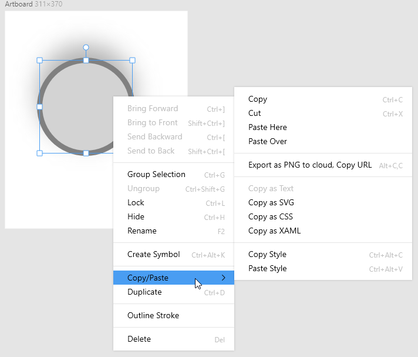
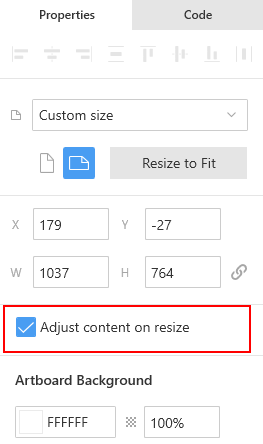
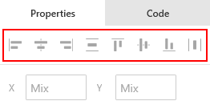
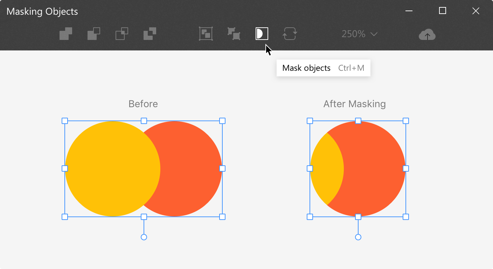

---
# Page settings
layout: default
keywords:
comments: false

# Hero section
title: Objects
description: Learn about basic operations with objects in Lunacy
icon: 'ungroup-objects'

# Micro navigation
micro_nav: false

# Page navigation
page_nav:
    next:
        content: Text
        url: '/text'
    prev:
        content: Editing
        url: '/editing'
---

## Introduction

In Lunacy you will work with the following types of objects:

* <a href="https://docs.icons8.com/interface/#artboards" target="_blank">Artboards</a>
* <a href="https://docs.icons8.com/text/" target="_blank">Text objects</a>
* <a href="https://docs.icons8.com/tools/#pen-tool" target="_blank">Vector objects</a>
* <a href="https://docs.icons8.com/tools/#shape-tool" target="_blank">Shapes</a>
* <a href="https://docs.icons8.com/tools/#image-tool" target="_blank">Images</a>
* <a href="https://docs.icons8.com/symbols/" target="_blank">Symbols and symbol instances</a>
* <a href="https://docs.icons8.com/tools/#icon-tool" target="_blank">Icons</a> 
* <a href="https://docs.icons8.com/tools/#hotspot-tool" target="_blank">Hotspots</a> 

For specifics on working with each type of objects, follow the above links. This section provides an overview of basic operations common for all object types.

## Adding objects

To add an object to the canvas:

1. Enable the respective <a href="https://docs.icons8.com/tools" target="_blank">tool</a> on the toolbar or with a shortcut (see the note below).
2. Click or click and drag over the area where you want to place the object.

If you need to create a regular shape (for example, a circle or a square), hold down `Shift` while dragging.

That is the most common method used in all similar applications. When you use it, the point from where you start dragging becomes an angle of the shape, if it is a rectangle, or an angle of its selection frame, if it is anything else. If you want the starting point to become the center of the shape, hold down `Alt` while dragging and `Alt + Shift` to get a regular shape (see the demo below).

<video autoplay="" muted="" loop="" playsinline="" width="auto" poster="/public/objects-addingplaceholder.png" height="auto"><source src="/public/objects-adding.mp4" type="video/mp4"></video>

**Note:** To check out the shortcuts available in Lunacy, click the **Keyboard Shortcuts** button at the bottom of the toolbar (this will open the shortcuts panel in Lunacy) or read <a href="https://docs.icons8.com/shortcuts/" target="_blank">here</a>.

{:.image-info}
The Keyboard Shortcuts button

## Selecting objects

There are two ways to select objects in Lunacy.

**Way 1. Selecting objects in the Objects panel**

To select an object through the **Objects** panel, just find it in the list of objects and click it. To select multiple objects press down `Shift` or `Ctrl` while clicking.  

**Way 2. Selecting objects on the canvas**

To select an object, use the select tool which gets enabled when no other tool is active. Just click the object or click and drag over it.

To select multiple objects, hold down the `Shift` key and click the objects you want to select. Also, you can click and drag over these objects.

When you click or drag over a group of objects, you select the group. To select a certain object within a group:

* Hold down the `Ctrl` key and click over the required object.
  
  OR
* Click to select the group, then double-click to select the object.

After you select an object within a group, you can switch to other objects of that group by simply clicking them.

For details about using the select tool and a demo, click <a href="https://docs.icons8.com/tools/#select-tool" target="_blank">here</a>.

## Moving objects

To move an object, just click and drag it. Make sure that the cursor is over the object rather than over the empty space within the object's selection frame.

If you want to restrict movement to the X or Y axis, hold down `Shift` as you drag.

For precise positioning you can use the arrow keys. Each keystroke moves an object by one pixel. Holding down `Shift` increases each step to 10 pixels.

<video autoplay="" muted="" loop="" playsinline="" width="100%" poster="/public/objects-movingplaceholder.png" height="auto"><source src="/public/objects-moving.mp4" type="video/mp4"></video>

Also, to adjust an object's position on the canvas or artboard, you can use the **X** and **Y** controls in the Inspector. If an object is on the canvas, the figures in the **X** and **Y** fields show the absolute coordinates of the object's top-left selection handle.

If the object is a part of an artboard, **X** and **Y**  display the coordinates of the object's top-left selection handle relative to the artboard's top-left corner. See the demo below and the <a href="https://docs.icons8.com/interface/#tips-on-working-with-the-Inspector" target="_blank">tips</a> on working with numeric fields in the Inspector.

<video autoplay="" muted="" loop="" playsinline="" width="auto" poster="/public/objects-moving1placeholder.png" height="auto"><source src="/public/objects-moving1.mp4" type="video/mp4"></video>

## Grouping objects

You can combine together multiple objects relating to the same design element and then move and resize them as a single object. Also, object grouping is a way to organize your object list, which in some projects can include hundreds of items or more. For this, you can create nested object groups within other groups.

To create a group, select the objects that you want to group and click the **Group** button () on the context toolbar or press `Ctrl+G`.

To select a certain object within the group:

* Hold down the `Ctrl` key and click over the required object.
  
  OR
* Click to select the group, then double-click to select the object.

After you select an object within a group, you can switch to other objects of that group by simply clicking them. Alternatively, you can select objects through the **Objects** panel. In some cases it may be more convenient. For instance, when handling fully overlapping objects.

You can move objects into or out of a group by dragging them in the **Objects** panel.

<video autoplay="" muted="" loop="" playsinline="" width="100%" poster="/public/objects-groupingplaceholder.png" height="auto"><source src="/public/objects-grouping.mp4" type="video/mp4"></video>

To ungroup objects, select the group and click the **Ungroup** button () on the context toolbar or press `Ctrl+Shift+G`.

## Duplicating objects

To duplicate an object, select it and press `Ctrl+D`. Alternatively, you can hold down `Alt`, select the object and drag to where you want to place the duplicate.

Lunacy remembers the offset of the latest duplicate. So, if you press `Ctrl+D` shortly after you create a duplicate of and object, Lunacy will add another duplicate with the same offset as the previous one (see the demo below). This can be handy for designing patterns or things alike.

<video autoplay="" muted="" loop="" playsinline="" width="auto" poster="/public/objects-duplicateplaceholder.png" height="auto"><source src="/public/objects-duplicate.mp4" type="video/mp4"></video>

And of course, you can use the **Duplicate** command and standard **Copy** and **Paste** options available on the context menu.

## Copy and Paste options

You can simply select an object and use the standard `Ctrl+C` and `Ctrl+V` combination. This will create a copy of the object right above the original.

Also, you can make use of other related options available on the context menu.

The table below provides a description of these options.

<table>
  <thead>
      <tr>
        <th>Menu option</th>
        <th>Description</th>
      </tr>
  </thead>
  <tbody>
      <tr>
        <td><b>Copy</b></td>
        <td>Copies the selection to the clipboard.</td>
      </tr>
      <tr>
        <td><b>Cut</b></td>
        <td>Cuts the selection from the canvas and copies it to the clipboard.</td>
      </tr>
      <tr>
        <td><b>Paste Here</b></td>
        <td>Pastes the content of the clipboard onto the canvas. The point where you right-click is the place where Lunacy will place the top-left selection handle of the object you paste.</td>
      </tr>
      <tr>
        <td><b>Paste Over</b></td>
        <td>Pastes the content of the clipboard over the selected object so that the top-left selection handle of the object that you paste will have the same coordinates as the one of the selected object.</td>
      </tr>
      <tr>
        <td><b>Export as PNG to cloud, Copy URL</b></td>
        <td>Exports the selection to the Icons8 cloud and copies the link to your clipboard. You can share this link with other people.</td>
      </tr>
      <tr>
        <td><b>Copy as Text</b></td>
        <td>Available for the text objects only. Copies the text content, not the object and its properties.</td>
      </tr>
      <tr>
        <td><b>Copy as SVG/CSS/XAML</b></td>
        <td>These options allow you to copy the code of the selected object in the required format.</td>
      </tr>
      <tr>
        <td><b>Copy style/Paste style</b></td>
        <td>These options allow you to copy the <a href="https://docs.icons8.com/styling" target="_blank">styling properties</a> of the selected object and apply them to another object. See the demo below.</td>
      </tr>
  </tbody>
</table>

The demo below shows how you can copy and paste styling properties between objects.

<video autoplay="" muted="" loop="" playsinline="" width="100%" poster="/public/objects-copypasteplaceholder.png" height="auto"><source src="/public/objects-copypaste.mp4" type="video/mp4"></video>

## Resizing objects

There are several ways how you can resize objects:

* by dragging selection handles
* through the Inspector
* scaling

### Resizing an object by dragging selection handles

To resize an object, drag any of its selection handles as shown in the demo below. Use the handles on the sides, to change the object's height or width. Use the corner handles to adjust the object's height and width at the same time.  Hold down `Shift` while dragging to preserve the object's aspect ratio.

<video autoplay="" muted="" loop="" playsinline="" width="auto" poster="/public/object-resizing1.png" height="auto"><source src="/public/object-resizing1.mp4" type="video/mp4"></video>

Also, you can hold down `Alt` while dragging to resize the object from its center, rather than from the edge that you are dragging.

The `Alt+Shift+drag` combination is also possible to preserve the object's aspect ratio.

### Resizing an object through the Inspector

Select the object and use the **W** (width) and **H** (height) edit fields, when you need to define the exact size of an object.

<video autoplay="" muted="" loop="" playsinline="" width="auto" poster="/public/object-resizing2.png" height="auto"><source src="/public/object-resizing2.mp4" type="video/mp4"></video>

Click the links button to preserve the object's aspect ratio. With this button enabled, the change of a value in one of the boxes, will result in respective value adjustment in the second box.

Also, read <a href="https://docs.icons8.com/interface/#tips-on-working-with-the-Inspector" target="_blank">here</a> for some tips on working with numeric fields in the Inspector.

### Scaling objects

If you want to resize an object with styling (borders, shadows, etc.), you should consider the scaling feature. Together with object size, it will accordingly adjust the values of its styling properties.

To scale an object:

1. Select the object.
2. Click the **Scale** button on the context toolbar or use the `Ctrl+K` shortcut.
3. In the displayed dialog box, define the scale percentage or enter the desired object width/height.
4. Select the point from which scaling will be done (the default setting is *Scale from center*).
5. Click **OK**.

See the demo below and note how the value of the border thickness changes with the object size.

<video autoplay="" muted="" loop="" playsinline="" width="100%" poster="/public/object-resizing3.png" height="auto"><source src="/public/object-resizing3.mp4" type="video/mp4"></video>

### Resizing constraints

Resizing constraints allow you to determine the behavior of an object upon resizing of a group, symbol or an artboard to which the object belongs. This can be very useful, for example, when you need to design a user interface for different screen sizes or devices.

First of all, if you want objects on an artboart to resize when you adjust the size of the artboard:

1. Select the artboard through the **Objects** panel or by clicking its name on the canvas. The artboard Inspector panel appears on the right.
2. In the Inspector, make sure that the **Adjust content on resize** checkbox is selected.

Also, you can configure individual resize behavior of each object using the controls in the **Resizing** section of the object Inspector.

These controls include:

* The **Pin to edge** control. Allows you to pin the object to one or several edges of the artboard or its parent, if the object is a part of a group/symbol. So, when you resize the artboard or the parent, Lunacy won't change the distance between the object and the edges it is pinned to. Click the respective T-shaped buttons to pin the object.
* The **Fix width** and **Fix size** checkboxes. Allow you to restrict the change of the object's width or height upon resizing of the artboard or the parent object.

To better understand how all this works, see the demo below.

<video autoplay="" muted="" loop="" playsinline="" width="100%" poster="/public/objects-constraintsplaceholder.png" height="auto"><source src="/public/objects-constraints.mp4" type="video/mp4"></video>

## Aligning and distributing objects

To quickly align and distribute objects on the canvas, use the controls in the top row of the Inspector.

They become active only when you select two or more objects anywhere on the canvas, or when you select a single object on an artboard. In the latter case, Lunacy will align the object relative to the bounds of the artboart.

The table below provides a description of the controls.

<table>
  <thead>
    <tr>
      <th>Button</th>
      <th>Description</th>
      <th style="width: 130px;">Keyboard shortcut</th>
    </tr>
  </thead>
  <tbody>
    <tr>
      <td></td>
      <td><b>Align Left</b>. Aligns the selected objects to the left bound of their selection frame.</td>
      <td><code>Shift + Ctrl + &leftarrow;</code></td>
    </tr>
    <tr>
      <td></td>
      <td><b>Align Horizontally</b>. Horizontally centers the selected objects.</td>
      <td><code>Ctrl + Shift + -</code></td>
    </tr>
    <tr>
      <td></td>
      <td><b>Align Right</b>. Aligns the selected objects to the right bound of their selection frame.</td>
      <td><code>Shift + Ctrl + &rightarrow;</code></td>
    </tr>
    <tr>
      <td></td>
      <td><b>Distribute Vertical Spacing</b>. Evens vertical spacing between the selected objects. Note that the topmost and the lowermost objects in the selection always preserve their original position, while the objects between them adjust their position to ensure equal spacing.</td>
      <td><code>Shift + Ctrl + V</code></td>
    </tr>
    <tr>
      <td></td>
      <td><b>Align Top</b>. Aligns the selected objects to the top bound of their selection frame.</td>
      <td><code>Shift + Ctrl + &uparrow;</code></td>
    </tr>
    <tr>
      <td></td>
      <td><b>Align Vertically</b>. Vertically centers the selected objects.</td>
      <td><code>Ctrl + Shift + |</code></td>
    </tr>
    <tr>
      <td></td>
      <td><b>Align Bottom</b>. Aligns the selected objects to the bottom bound of their selection frame.</td>
      <td><code>Shift + Ctrl + &downarrow;</code></td>
    </tr>
    <tr>
      <td></td>
      <td><b>Distribute Horizontal Spacing</b>. Evens horizontal spacing between the selected objects. Note that the rightmost and the leftmost objects in the selection always preserve their original position, while the objects between them adjust their position to ensure equal spacing.</td>
      <td><code>Shift + Ctrl + H</code></td>
    </tr>
  </tbody>
</table>

To better understand how it all works, see the demo below.

<video autoplay="" muted="" loop="" playsinline="" width="100%" poster="/public/objects-aligndistrpaceholder.png" height="auto"><source src="/public/objects-aligndistr.mp4" type="video/mp4"></video>

## Arranging objects along the Z-axis

To position objects along the Z-axis, use the send/bring commands found on the context menu or their respective shortcuts. The commands are as follows:

* Bring Forward (`Ctrl` `]`). Moves the selected object one step forward.
* Bring to Front (`Shift` `Ctrl` `]`). Places the selected object to the very front of the stack.
* Send Backward (`Ctrl` `[`). Moves the selected object one step backward.
* Send to Back (`Shift` `Ctrl` `[`). Places the selected object to the very back of the stack.

The demo below shows how it works.

<video autoplay="" muted="" loop="" playsinline="" width="100%" poster="/public/objects-sendbringplaceholder.png" height="auto"><source src="/public/objects-aligndistr.mp4" type="video/mp4"></video>

Also, you can do the same by dragging objects up and down relative one another in the object list.

## Rotating objects

To rotate an object:

1. Select the object.
2. Hover the cursor somewhere near any corner selection. Wait a moment until the cursor turns into a bended double-headed arrow, then drag.
  
    OR

    In the Inspector, enter the required value in the rotation angle field and press `Enter`.

To quickly return the object into its initial position:

* In the angle rotation field of the Inspector, type *0* and press `Enter` to submit.

## Flipping objects

To flip the selected object, use the **Flip Horizontally** () and **Flip Vertically** () buttons that appear on the context toolbar.

<video autoplay="" muted="" loop="" playsinline="" width="auto" poster="/public/objects-flipplaceholder.png" height="auto"><source src="/public/objects-flip.mp4" type="video/mp4"></video>

Alternatively, you can use the following shortcuts:

* <code>Ctrl + &rightarrow;</code> or <code>Ctrl + &leftarrow;</code>  - horizontal flip.
* <code>Ctrl + &uparrow;</code> or <code>Ctrl + &downarrow;</code> - vertical flip.

Also, the **Flip Horizontally** and **Flip Vertically** commands are available on the **Object** menu.

Another way to flip an object is to drag selection handles as shown in the demo below.

<video autoplay="" muted="" loop="" playsinline="" width="auto" poster="/public/objects-flipplaceholder.png" height="auto"><source src="/public/objects-flip2.mp4" type="video/mp4"></video>

## Boolean Operations

Using boolean operations, you can easily draw complex shapes using primitives.

* Union: The result is a vector that is the sum of both vectors’ areas.
* Subtract: The result is a vector where the area of the top shape is removed from the one under it.
* Intersect: The result is a vector consisting of the parts where the original shapes overlapped.
* Difference: The result is a vector that is exactly the part where they didn’t overlap. It’s the inverse of an intersect operation.

{:.is-big}

Also, Lunacy has a Flatten selection operation: The result is a vector that represents the multiple paths inside the shape as one path. However, there are many paths that can’t be flattened into one. A shape with a hole inside it will always represent as two paths; one for outer path, and one for the inner path.

{:.is-big}

## Masks

Masks (keyboard shortcut `Ctrl` `M`) in Lunacy are used to show parts of objects selectively. For example, masking two overlapping ovals gives you an oval image.

{:.is-big}

{:.image-info}
Masking objects