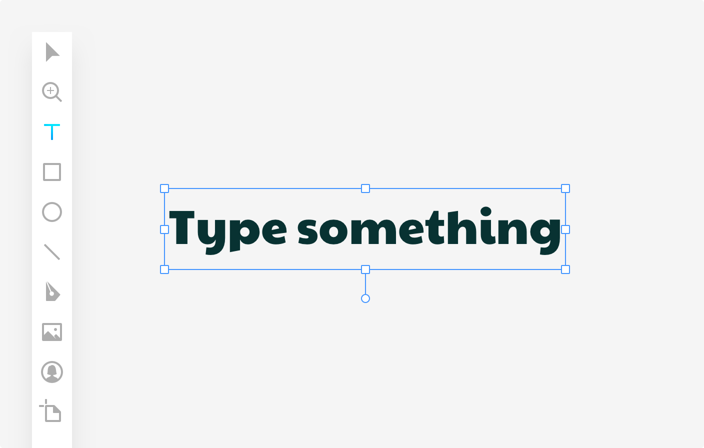
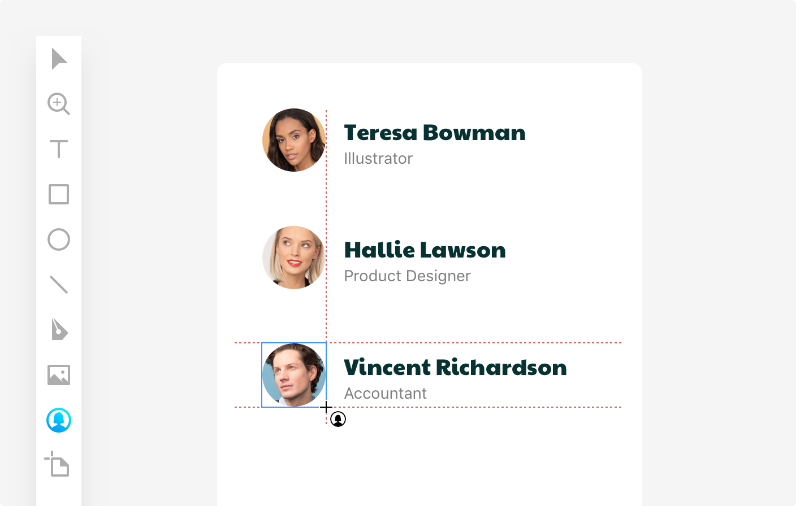

---
# Page settings
layout: default
keywords:
comments: false

# Hero section
title: Objects
description: Learn about shapes that Lunacy provides
icon: 'ungroup-objects'

# Micro navigation
micro_nav: false

# Page navigation
page_nav:
    next:
        content: Styling
        url: '/styling'
    prev:
        content: Editing
        url: '/editing'
---

## Shortcuts for the Tools

Lunacy supports the typical tools for any vector editor.

<table>
  <thead>
    <tr>
      <th>Object</th>
      <th>Keyboard shortcut</th>
    </tr>
  </thead>
  <tbody>
    <tr>
      <td>Text</td>
      <td><code>T</code></td>
    </tr>
    <tr>
      <td>Rectangle </td>
      <td><code>R</code></td>
    </tr>
    <tr>
      <td>Oval</td>
      <td><code>O</code></td>
    </tr>
    <tr>
      <td>Line</td>
      <td><code>L</code></td>
    </tr>
    <tr>
      <td>Bitmap</td>
      <td><code>P</code></td>
    </tr>
    <tr>
      <td>Avatar</td>
      <td><code>Ctrl</code> <code>P</code></td>
    </tr>
    <tr>
      <td>Artboard</td>
      <td><code>A</code></td>
    </tr>
  </tbody>
</table>

Let’s review some of these tools in more detail.

## Text

You can add text by choosing the Text tool from the Shapes and Objects toolbar (or press `T`). The pointer changes to the Text Input tool icon and then you can click anywhere in the Canvas to insert your text layer at that point. When you click on a canvas, a new text layer will be inserted with a “Type something” placeholder, ready for you to add your text.

{:.is-big}

{:.image-info}
Text tool in action

When you have a text layer selected you will notice that the Inspector changes to show you all the properties that apply to text. Underneath the standard object properties, there’s an area for text style options which includes:

* Font family
* Font size
* Font weight
* Font color
* Line spacing
* Alignment options

{:.is-big}

{:.image-info}
All options you need to work with text

### Missing Fonts, Solved

When working with Sketch files that have been downloaded from the internet, or received from a colleague, it may contain fonts that you do not have on your system.

### Auto Downloading

If you open a file with missing fonts, Lunacy will check Google Fonts and download those that are missing. The process is so smooth, that you’ll never even notice it.

### Auto Installation

All the Google Fonts are already in the list. When you choose any one of them, Lunacy downloads it from the Google service. Smooth!

### Auto Replacing

In Lunacy, you only have to replace the font once throughout the entire document, while other editors require you to do it for every font instance.

[//]: # (Maybe we should cut the above into couple sentences - ib)

## Squares, Circles, Straight Lines

If you need a square, choose the Rectangle tool and hold `Shift` while drawing. You easily can create other primitives as well.

{:.is-big}

{:.image-info}
Basic primitive objects

## Bitmaps

Bitmaps, or images are one of the object types that are supported in Lunacy. Bitmaps, (or raster) images are made up of pixels; those images can take many forms, such as screenshots or photographs. Lunacy supports all the most common image formats, like PNG, JPG, JPEG.

{:.is-big}

{:.image-info}
Image tool will help you to insert bitmap graphic into your designs

## Avatar Tool

When designing user interfaces, one of the most common tasks is creating avatars. This time consuming process is easy with Lunacy, as it has a tool specifically for this. The avatar tool lets you create them in one click.

{:.is-big}

{:.image-info}
Image tool will help you to insert bitmap graphic into your designs

## Masks

The masks (keyboard shortcut `Ctrl` `M`) in Lunacy are used to show parts of objects selectively. For example, masking two overlapping ovals gives you an oval image.

{:.is-big}

{:.image-info}
Masking objects

## Boolean Operations

Using boolean operations, you can easily draw complex shapes using primitives.

* Union: The result is a vector that is the sum of both vectors’ areas.
* Subtract: The result is a vector where the area of the top shape is removed from the one under it.
* Intersect: The result is a vector consisting of the parts where the original shapes overlapped.
* Difference: The result is a vector that is exactly the part where they didn’t overlap. It’s the inverse of an intersect operation.

{:.is-big}

Also, Lunacy has a Flatten selection operation: The result is a vector that represents the multiple paths inside the shape as one path. However, there are many paths that can’t be flattened into one. A shape with a hole inside it will always represent as two paths; one for outer path, and one for the inner path.

{:.is-big}
