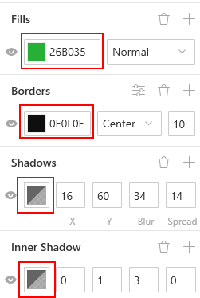
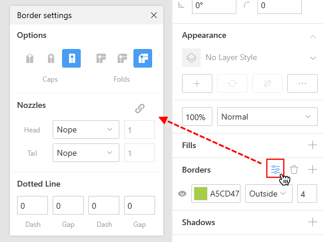
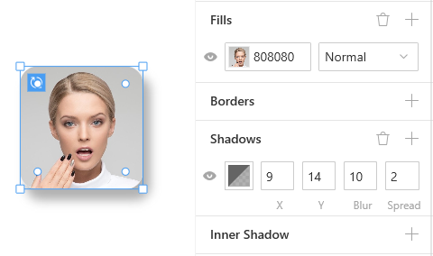

---
# Page settings
layout: default
keywords:
comments: false

# Hero section
title: Styling
description: Learn about tools that will help you create your unique style
icon: 'design'

# Micro navigation
micro_nav: false

# Page navigation
page_nav:
    next:
        content: Symbols
        url: '/symbols'
    prev:
        content: Text
        url: '/text'
---

Styling options that you can apply to objects in Lunacy include:

* Fills (solid, gradient and image fills)
* Borders
* Shadows
* Inner shadows
* Blurs (Gaussian and background)

All these options appear in the Inspector when you select an object. The details about using each of the options you will find in the sections below. But first of all let us review some common things.

## Adding, deleting and managing styling options

To apply a fill, border or any other styling to an object:

1. Select the required object.
2. Click the + button next to the respective styling section in the Inspector. A row of controls appears.
3. Use these controls to define the required styling parameters (see the demo below).

<video autoplay="" muted="" loop="" playsinline="" width="auto" poster="/public/styling-commondemoph1.png" height="auto"><source src="/public/styling-commondemo1.mp4" type="video/mp4"></video>

The things that you should know:

* Each object can have multiple styling options of the same type (except for blurs). For instance, you can apply an image fill to an object and a semi-transparent solid fill on top of it. Also, an object can have several borders or shadows. Just click the + icon to add another row of settings.

* You can drag these rows of settings up and down to adjust the position of their instances on the canvas.

* You can temporarily disable some of the settings, by clicking the eye icon in front of the row.

* To delete a row of settings, select it and click the trash icon.

All these things are shown in the next demo. It presents an object with a single fill and three borders.

<video autoplay="" muted="" loop="" playsinline="" width="auto" poster="/public/styling-commondemoph.png" height="auto"><source src="/public/styling-commondemo.mp4" type="video/mp4"></video>

## [Color controls](#color-controls)

Color controls appear in all styling sections (except for blurs) and serve for defining the color of the selected object or its borders or shadows.

You can:

* Click the color box and use the [color picker](#color-picker).
* Manually enter or paste the HEX value of the required solid fill.
* Copy HEX, RGBA or HLS value of the current solid fill. For this, right-click over the text box and select the required option on the displayed menu as shown in the figure below.

The last two options do not apply to shadows as they don't have the color text box.

## [Color picker](#color-picker)

To open the color picker, click the color box in the styling section you are working with.

The figure below shows a view of the color picker invoked from the fills section.

It features the following controls:

1. Fill type buttons. Available on the fill and border color pickers only.
2. Color selection box. That is where you will select colors.
3. Color selection bar. Allows you to quickly navigate through colors.
4. Opacity controls.
5. The eyedropper tool. For details about using it, read <a href="https://docs.icons8.com/tools/#eyedropper-tool" target="_blank">here</a>.
6. The color code box. Displays the code of the currently selected color (HEX or RGB).
7. The panel of preset colors. To speed up your work with colors, you can save them for further use and select them directly from this panel. There are two types of preset colors:
    * **Global** colors appear on the color picker in all documents.
    * **Document** colors belong only to the current document.
    
    To switch between the panels of global and document colors click the panel name. To delete a preset, right-click over it, then select **Remove** on the displayed menu.
8. Use this button to add the currently selected color to **Global** or **Document** presets.
9. Use this button to switch the panel of presets between the list and grid view. In the list view, you can give names to colors: right-click a color and select **Rename** on the displayed menu (see the demo below).

<video autoplay="" muted="" loop="" playsinline="" width="100%" poster="/public/styling-pickerph.png" height="auto"><source src="/public/styling-picker.mp4" type="video/mp4"></video>

## Fills

There are three major types of fills:

1. Solid fills (default).
2. Gradient fills that can be:
    * Linear
    * Radial and 
    * Angular
3. Image fills.

The figure below shows a view of settings in the **Fills** section.

The section features the following controls:

1. The [color control](#color-controls) for setting fills.
2. The blend mode control. Blend modes determine, in case of multiple fills, how the top fill blends with the fill underneath. Understanding blend modes is mainly a matter of practice and experimenting, but if you need some theory, you can read it <a href="https://en.wikipedia.org/wiki/Blend_modes" target="_blank">here</a>.

### Solid fills

To define a solid fill:

* Click the color box in the color control and use the [color picker](#color-picker) to define the required color.

  OR
* Type or paste the HEX code of the required color in the edit field and press `Enter`.
 
### Gradients

Gradients are combinations of two or more colors blended into each other within the same fill layer.

To add a gradient fill:

1. In the **Fills** section of the Inspector, click the color box. The [color picker](#color-picker) appears.
2. At the top of the color picker click one the following buttons (1) to select the gradient type:

    *  - linear
    *  - radial
    *  - angular

    As you do it, the gradient bar (2) with two handles gets displayed in the color picker. Also, you will see a gradient control with two color points (3) over the object. The appearance of the gradient control depends on the selected gradient type. The next figure shows a linear gradient (see also the demos below).

    

3. Use the gradient control and/or the gradient bar to get the desired effect. The handles on the gradient bar correspond to color points over the object. Actions applicable to all types of gradients:

    * To change the color of a color point click it (or its respective handle on the gradient stripe), and select the required color in the color selection box (4).  
    * To add a color to a gradient, just click over the gradient bar  or the gradient control. To adjust the color position move the handles or color points.
    * To delete a color, point the cursor over the respective color point or handle and press `Del`.

4. (optional) To save a gradient to presets, select the preset type (*Global* or *Document*) and click the plus icon.
5. Close the color picker when you are done.

#### Linear gradients

The demo below shows what you can do when adding a linear gradient.

<video autoplay="" muted="" loop="" playsinline="" width="100%" poster="/public/styling-lineargradph.png" height="auto"><source src="/public/styling-lineargrad.mp4" type="video/mp4"></video>

#### Radial gradients

When you select the radial type, the gradient control becomes a radius of a circle. You can:

* Select the edge color point to change the size of the circle.
* Select the center color point and drag it to reposition the origin of the gradient.
* Drag the square handles on the edge of the circle to resize or reshape it into an ellipse.

<video autoplay="" muted="" loop="" playsinline="" width="auto" poster="/public/styling-radialgradph.png" height="auto"><source src="/public/styling-radialgrad.mp4" type="video/mp4"></video>

#### Angular gradients

When you select the angular type, the gradient control takes the form of a circle with color points sitting on its edge. Drag the points around the circle to get the desired gradient. Add some extra color points, if needed.

<video autoplay="" muted="" loop="" playsinline="" width="100%" poster="/public/styling-angularph.png" height="auto"><source src="/public/styling-angular.mp4" type="video/mp4"></video>

### Image fills

To create an image fill:

1. Click the color box.
2. In the top bar of the color picker, click .
3. Click **Choose image**.
4. In the displayed dialog box, select the required image on your computer and click **Open**. See also the tip below.
5. Use the drop-down list below the **Choose image** button to select the type of fill:
    
     * **Fill**. Adjusts the image size to the object's width.
     * **Fit**. Adjusts the image size  to fit the object's height.
     * **Stretch**.  Stretches the image for it to fit the object's height and width.
     * **Tile**. Tiles the image to fit the object. The size of tiles is adjustable (see the demo below).
6. Close the color picker, when you are through.

<video autoplay="" muted="" loop="" playsinline="" width="100%" poster="/public/styling-imagefillph1.png" height="auto"><source src="/public/styling-imagefill1.mp4" type="video/mp4"></video>

**Tip:** You can also create an image fill by dropping an image from the Lunacy library or your desktop directly on to the object as shown in the demo below. As a matter of fact, what the <a href="https://docs.icons8.com/tools/#avatar-tool" target="_blank">avatar tool</a> does is that it creates rounded rectangles with image fills, where images are random photos of people.  

<video autoplay="" muted="" loop="" playsinline="" width="100%" poster="/public/styling-imagefillph.png" height="auto"><source src="/public/styling-imagefill.mp4" type="video/mp4"></video>

## Borders

As the name of this styling section suggests, here you will manage the appearance of borders in shapes. But it is also the place where you will define the color, thickness and other parameters of lines, curves, arrows and other open paths.

The figure below shows a view of settings in the **Borders** section.

The section features the following controls:

1. The [color control](#color-controls) for setting border colors. You can apply both solid and gradient fills to borders.
2. The border position control. Available for closed paths (shapes) only. You can choose between the inside, outside or center (default) of the outline. The difference between these options is shown in the figure below. The only option available for open paths (lines, arrows, curves, etc.) is the center.
3. The borders thickness control. Sets the thickness of a border or an open path in pixels.
4. This icon opens the advanced border settings (see below).

{:.image-info}
From top to bottom: outside, center, inside borders

### Advanced border settings

The advanced border settings include:

* **Caps**. Applicable to open paths only. Use these controls to define the shape of endings of open paths: no endings, round or square (see the demo below).
* **Folds**. You can these controls to adjust the appearance of border or open path corners: square, rounded, beveled (see the demo below).

<video autoplay="" muted="" loop="" playsinline="" width="100%" poster="/public/styling-capsfoldsph.png" height="auto"><source src="/public/styling-capsfolds.mp4" type="video/mp4"></video>

* **Nozzles**. Applicable to open paths only. Use this group of controls to set arrowheads.
* **Dotted line**. Use these controls to create dashed lines and borders. Define the length of dashes and gaps between them in respective text boxes. To restore a solid line/border, set all the values to *0*.

## Shadows

You can apply both outer and inner shadows to objects. Both these types have the same controls that include color, X and Y offsets, blur and spread. There can be multiple shadows of the same type.

## Blurs

Lunacy provides two types of blurs:

* **Gaussian** - blurs the selected object.
* **Background** - blurs the object underneath the selected object. To see the background blur effect, you should delete or hide the fill of the selected object or set its fill opacity to less than 100%. When working with this type of blur, in addition to the blur value you can also adjust the saturation of the blurred object.

To switch between blur types, click the down arrowhead next to a blur name and select the required option.

In the demo below, we first applied a Gaussian blur to an image, removed it and then applied a background blur to a rectangle above the image.

<video autoplay="" muted="" loop="" playsinline="" width="100%" poster="/public/styling-blursph.png" height="auto"><source src="/public/styling-blurs.mp4" type="video/mp4"></video>

**Note:** Blur is quite a demanding effect in terms of computing resources. Avoid excessive use of blurs within a document. For the same reason, we limited the maximum blur value to *50*.
