---
# Page settings
layout: default
keywords:
comments: false

# Hero section
title: Text
description: Learn how to work with text in Lunacy
icon: 'document'

# Micro navigation
micro_nav: false

# Page navigation
page_nav:
    next:
        content: Styling
        url: '/styling'
    prev:
        content: Objects
        url: '/objects'
---

## Text

Text is one of the key aspects of almost every design project. In this section you will learn how to work with text layers in Lunacy.

## Text-related controls

The figure below shows the location of text-related controls in the Lunacy interface.

1. The **Typography** section. Appears in the Inspector when a text layer is selected. Features all the settings that you might need when working with text. For details, click [here](#typography-settings).
2. The **Text** menu. Includes all the settings available in the **Typography** section of the Inspector, plus the **Convert to Outlines** command. This command also appears on the context menu. For details about converting text to outlines, click [here](#converting-text-to-vector-shapes).
3. The **Edit object** button. The button appears when you select a text layer. Click this button to start editing the text. Alternatively, just press `Enter`.
4. In the **Appearance** section you deal with [reusable text styles](https://docs.icons8.com/layerstyles/#text-styles). Also the section features the button that invokes the [floating style panel](#floating-panel).
5. The **Generate text** button. A click over the button generates a random text.
6. Another instance of the **Generate text** button. A click over the down arrowhead next to the button invokes the menu with text generation options. For details, click [here]((#text-generation-and-text-snippets)).

## Adding text layers

There are two ways of adding text layers.

**Way 1. Click and type**

1. Select the Text tool from the Shapes and Objects toolbar (or press `T` as a shortcut). The pointer changes to the Text Input tool icon.
2. Click anywhere on the canvas to insert your text layer. Once you click, a new text layer with the *Type something* placeholder appears.
3. Start typing to replace the placeholder with the text of your own.
4. Press `Esc` to exit the edit mode.

Lunacy applies [horizontal resize](#resize-options) to the text added this way.

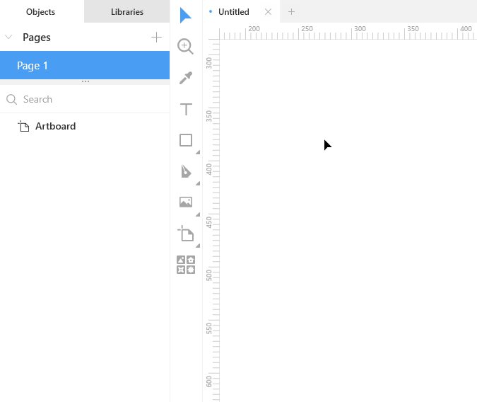

**Way 2. Click and drag**

1. Select the Text tool from the Shapes and Objects toolbar (or press `T`as a shortcut). The pointer changes to the Text Input tool icon.
2. Click on the canvas and hold down the mouse button.
3. Drag to create a text object of the required size. Lunacy will add a random text to fit the size of the object. If the auto-text exceeds the block size, you can delete the excess or leave it as is. It won't be visible unless the text block is in the edit mode.
4. Press `Esc` to exit the edit mode. Also, you can use the `Shift + R` shortcut to refresh the auto-generated text.

## Adding text to shapes

In Lunacy, when you need to add a text to a shape, you can do it in three simple steps:

1. Select the required shape.
2. Select the text tool or press `T`.
3. Enter your text.

As you do it, Lunacy automatically creates a group object with the shape and text layers. This small feature can be of great use when it comes to design of such UI elements as buttons, menus and things alike.

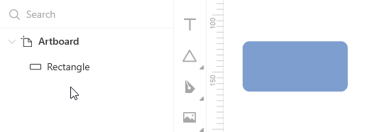

## Editing text

To edit a text:

1. Select the text layer in the **Objects** panel or by clicking it on the canvas.
2. Press `Enter` or click the **Edit Object** () button on the top bar to enable the edit mode.
3. Enter a new text or edit the existing one.
4. When done, press `Esc` to exit the edit mode.

## [Typography settings](#typography-settings)

When you select a text layer, the **Typography** section appears in the Inspector. The section features the basic typography settings. Also, you can click the settings button at the top left corner of the section to access advanced settings (see the figure below).

Typography settings include:

1. Font family
2. Font weight
3. Font color picker
4. Font size picker
5. Text alignment options
6. Line, letter and spacing options
7. Resize options
8. Position alignment options
9. Letter case options
10. Underline and strikethrough options
11. List type options
12. Superscript and subscript options

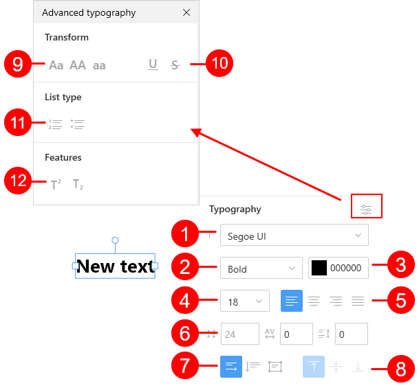

For details about each group of settings, read the sections below.

### Font family

The default font in Lunacy is Segoe UI, which is also the default font for many Windows apps.

To select another font:

* If you know the name of the font you need, type it in the text field of the font picker.

  OR
* Expand the font family list and pick up the one you like.

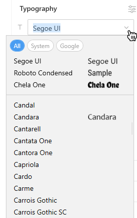

The top section of the font family list shows the three fonts that you've recently used.
The three buttons at the top of the list allow you to quickly filter the content of the list:

* All: Shows the full list of fonts.
* System: Shows the list of fonts installed on your computer.
* Google: shows the list of fonts available in the [Google fonts](https://fonts.google.com/) library. You don't need to download them. Lunacy will do it automatically. Lunacy's integration with Google fonts will solve most of you problems with missing fonts (click [here](#missing-fonts) for details).

The list shows font names and their samples. If a font's name is too long and appears truncated, hover a cursor over the name to view the full name. When you hover the cursor over font samples, Lunacy will display their larger previews. Google fonts come without samples until used.  

>**Note**: You might experience a slight delay when applying a Google font for the first time. Also, if your computer is not connected to the internet, the list of Google fonts will include only those fonts that you have already used.

#### [Missing fonts](#missing-fonts)

When you open a project received from your team or downloaded from the internet, Lunacy checks if all the required fonts are available on your computer. If some of them are missing but they are available in the Google fonts library, Lunacy will download and apply them, provided that your computer is connected to the internet. But if those fonts are not from the Google library:

* The default Segoe UI is applied to the text layers with missing fonts.
* Upon selection of these layers, the name of the missing font appears in red in the font picker, as well as in the **Objects** panel.
* The missing fonts button appears on the top toolbar.

A click over the button invokes a dialog box where you can select replacements for the missing fonts (see the figure below).

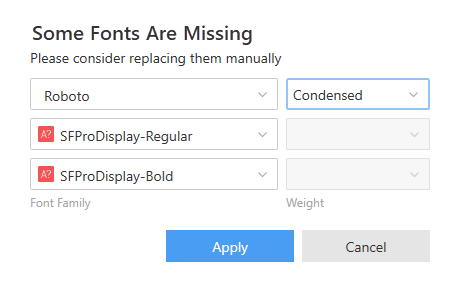

Unlike other editors, Lunacy will at once replace all the occurrences of missing fonts throughout the entire project.

### Font weight

Each font family comes with different sets of weights (also known as font styles), which might include: Regular, Bold, Semibold, Italic, etc.

The text weight control allows you to select the required font weight. If a font has only one weight, the control appears disabled (see the figure below)

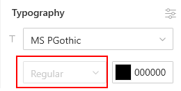

Also, you can use standard text editor shortcuts:

* `Ctrl+B`: Bold
* `Ctrl+I`: Italic

### Font color picker

This control is a standard color picker that allows you to choose the required color from the color field or from preset colors, as well as to manually enter the required color code. For more information about using the color picker, click [here](https://docs.icons8.com/styling/#color-picker).

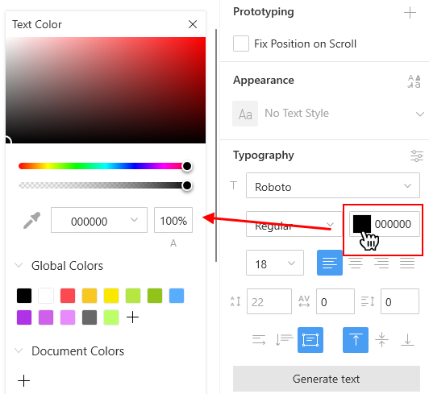

### Font size picker

Use this control to define the required font size in pixels. You can do it by:

* Selecting the required size from the list.
* Entering the required value in the edit field.
* Using the scroll.
* Using the `Ctrl + Alt + "+"` (increase) and `Ctrl + Alt + "-"` (decrease) shortcuts.

### Mixed font settings

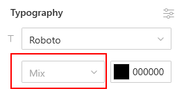

If a text within a layer comes in several fonts, colors, font sizes or weights (for example, one word is in bold, while the rest are in regular), the respective control will display *Mix*.

### Text alignment options

Use these buttons to align and justify the text inside the text box. Optionally, you can use the following shortcuts:

* `Ctrl + Alt + "{"`: Align text to the left.
* `Ctrl + Alt + "|"`: Center text.
* `Ctrl + Alt + "}"`: Align text to the right.
* `Ctrl + Alt + "J"`: Justify.

### Line, letter and paragraph spacing

Use these settings to adjust line, letter and paragraph spacing. Their default values are set  *x*, *0*, and *0* respectively, where *x* depends on the selected font family, font weight and size.

The default line spacing appears in grey. When you change it, the figures in the box turn black. To restore the default value, delete the current value and press `Enter`.

You can change spacing values in the following ways:

* By entering the required values in the edit fields.
* By using shortcuts:
  * `Ctrl+Alt+>`/`Ctrl+Alt+<` - increase/decrease line spacing.
  * `Ctrl+Shift+>`/`Ctrl+Shift+<` - increase/decrease letter spacing.
  * There is no shortcut for paragraph spacing.
* By using the scroll.
* By using mouse movements.

In the latter case:

1. Hover the cursor over an edit field and wait a moment until the cursor turns into a double-headed arrow.
2. Hold-down the left mouse button and move the mouse up to increase or down to decrease spacing (see the gif below).

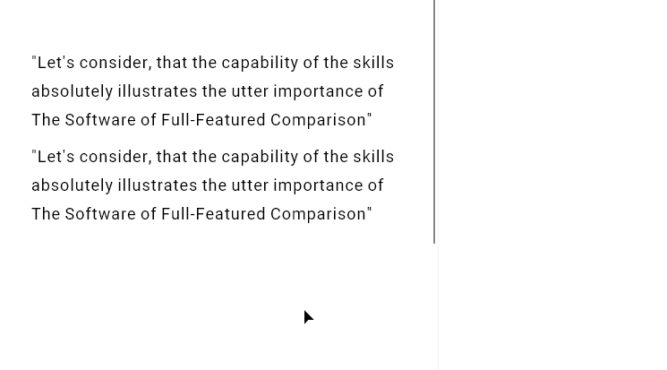

### [Resize options](#resize-options)

These three buttons determine the behavior of text boxes depending on the size of the content.

1. Horizontal resize: In this mode, the text box expands horizontally as wide as it is required to fit all the content on a single line.
2. Vertical resize: In this mode, the text box adjusts vertically to fit all the content while the width of the box remains unchanged.
3. Fixed size: In this mode, the size of the text box is fixed and, unlike in the above two modes, does not adjust to fit the content.

### Position alignment

Use these three buttons to adjust the position of text content within the text box:

* Align to the top border of the text box (default).
* Center text horizontally and vertically within the text box.
* Align text to the bottom border of the text box.

### Advanced typography options

To open the panel of advanced typography options, click the settings button at the top left corner of the **Typography** section.

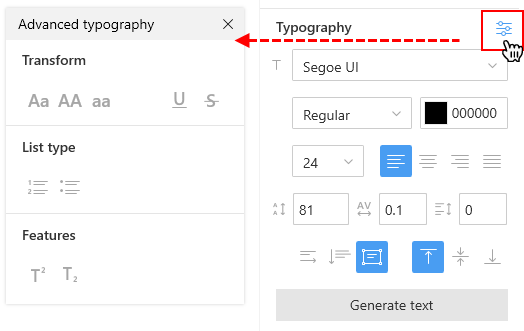.

The panel features the following:

* Letter case options:

  * Aa: Sentence Case (First-Letter Uppercase And The Rest Lowercase).
  * AA: ALL UPPERCASE.
  * aa: all lower case.

* Underline and strikethrough options.
* Numbered and bulleted lists.
* Superscript and subscript

## Common layer effects

In addition to typography settings, you can also apply common, non-text, styling effects to text layers which include:

* Fills
* Borders
* Shadows
* Inner shadows
* Blurs

All these settings appear in the Inspector, below the **Typography** section.

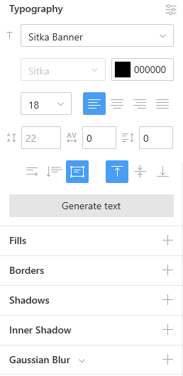.

Combinations of layer styling effects and typography settings make up text styles. You can save text styles to the document assets and [reuse](https://docs.icons8.com/layerstyles/#text-styles) them across your project. Also,you can find your recent text styles on the floating panel (see below).

>**Note:** When you edit a text whose style includes both typography and common layer settings, Lunacy hides layer styling effects and shows them back once you exit the edit mode. This is for the ease of editing heavily styled texts (see the gif below).

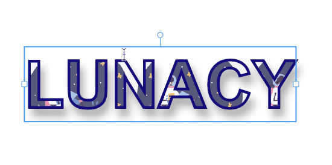

For details about styling properties, read [here](https://docs.icons8.com/styling/)

## [Floating panel](#floating-panel)

When working with text layers, you can make use of the floating style panel. In this panel you can find your recent text styles and quickly apply the required one to the currently selected layer.

The panel appears when you add a new text layer. You can also invoke it with the `Ctrl + Space` shortcut or by clicking the floating panel button in the Inspector.

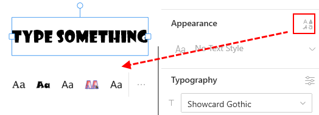

The panel shows your 5 recent styles and can store up to 21 styles (click the three dots button to see the rest). The latest styles appear first. If you are working with a new document and haven't applied any text styles yet, the panel will display a set of predefined styles.

You can select styles from the panel by clicking them. To preview a style, hover the cursor over a style for a moment. If you a keyboard person, use `Tab` to switch between the displayed styles and `Enter` to apply a style.

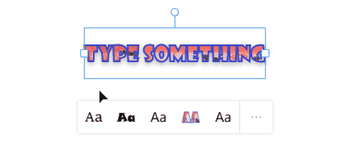

If you make changes to a style selected from the floating panel, they apply only to the currently selected layer and the style itself but they don't affect other layers with this style. Compare this behavior with [reusable layer styles](https://docs.icons8.com/layerstyles/#text-styles).

## [Converting text to vector shapes](#converting-text-to-vector-shapes)

Lunacy enables you to convert text layers into vector shapes.

For this:

1. Select a text layer and click **Text** on the menu bar or left-click over a text layer to invoke the context menu.
2. On the displayed menu, select **Convert to Outlines**. Lunacy will convert letters into a group of vector shapes, which will appear in the **Objects** panel.

Alternatively, you can use the `Ctrl+Shift+O` shortcut.

**Note**: Remember that the text-to-vector operation is demanding in terms of system resources. Attempts to convert large portions of text can seriously slow Lunacy down .

## [Text generation and text snippets](#text-generation-and-text-snippets)

Lunacy has a nice text generation feature that solves the headache of picking up texts for your prototypes. It works both for large text blocks and short text instances such as people names, mail and email addresses, phone numbers, etc.

When you add a text block using the click-and-drag method, Lunacy automatically inserts a random text which fits or slightly exceeds the block size. If you don't like the generated text you can refresh it.

For this:

1. Select the text layer.
2. Click the **Generate text** in the Inspector or the text generation button on the top bar until you get the text that you find acceptable.

Alternatively, you can use the `Ctrl+Shift+R` shortcut to refresh the content.

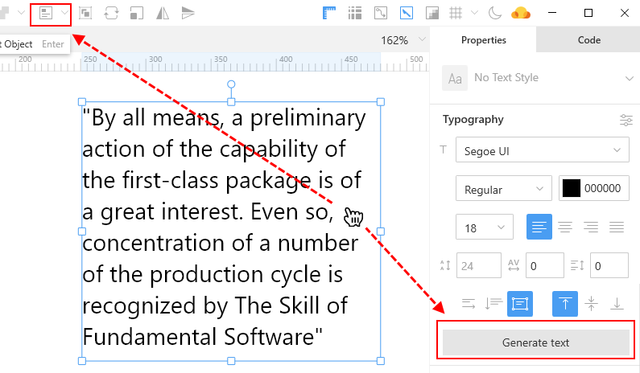

To generate such texts as names, addresses, etc., proceed as follows.

**Way 1. Selecting from the menu**

1. Select the required text block.
2. Click the down arrowhead next to the **Generate text** button. A menu with text categories appears.
3. Use the menu to select the required content. If necessary, use the `Shift + R` shortcut or any of the **Generate text** buttons to refresh generated content.

**Way 2. Using text snippets**

In Lunacy, text snippets are short commands for generation of specific texts. Snippets always begin with a semicolon (;) followed by a full or short form of the command. For instance, to generate an email address, you should type *;email* or *;em*. To generate a credit card number, type *;creditcard* or *;cr*, and so on. You can always look up the list of snippets on the menu with text categories (see *Way 1*) or in the shortcuts panel.

1. Select the required text block.
2. Press `Enter` or click the **Edit Object** button on the top bar to enable the edit mode.
3. Enter the required snippet and and press `Esc`. Use the `Shift + R` shortcut to refresh generated content, if needed.

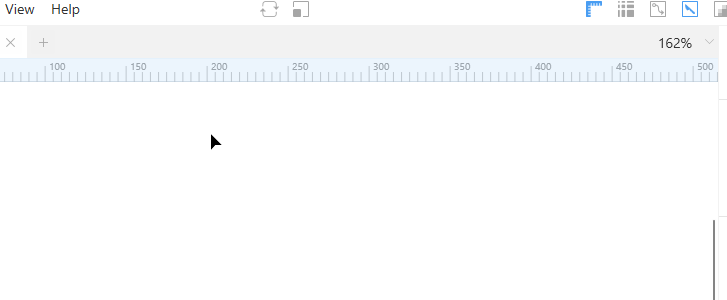
